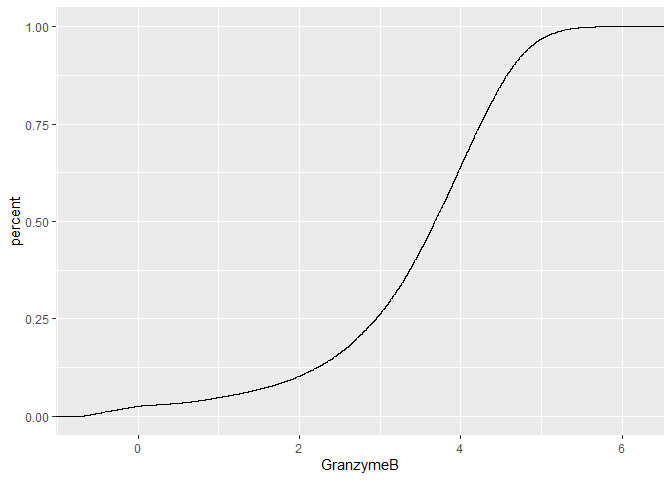
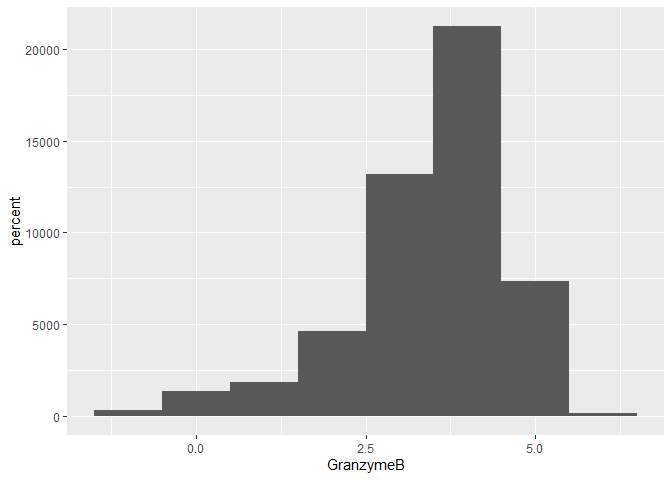
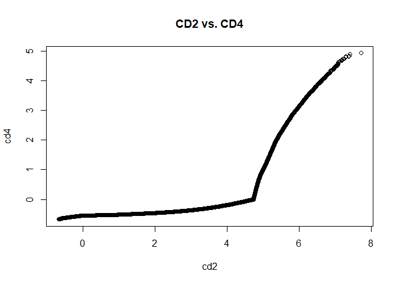

FA1
================
Baybayon, Darlyn Antoinette

``` r
library(ggplot2)
library(magrittr)
library(stringr)
library(gridExtra)
dataset <- read.csv("cytof_one_experiment.csv")

save(dataset, file="my_work_space.RData")
```

##### ECDF plot for GranzymeB

``` r
granzymeB <- dataset$GranzymeB
ggplot(dataset, aes(x = granzymeB)) + stat_ecdf() + xlab("GranzymeB") + ylab("percent")
```

<!-- -->

This plot shows a slow increase at lower values, sharp rise in the
middle. This means that most of the values in this column are
concentrated in the middle and less extreme lower values.

##### Histogram plot for GranzymeB

``` r
ggplot(dataset, aes(x = granzymeB)) +geom_histogram(binwidth = 1) + 
  xlab("GranzymeB") + ylab("percent")
```

<!-- -->

The histogram for granzymeB is skewed to the left which means that most
of the values in this column are large and there are less lower values.

##### Q-Q plot for CD2 and CD4

``` r
cd2 <- dataset$CD2
cd4 <- dataset$CD4


qqplot(cd2, cd4,  main = "CD2 vs. CD4") 
```

<!-- -->

This plot deviates significantly from a straight diagonal line which
implies that the quantiles do not have a similar distribution.Towards
the right, CD4 values increase sharply compared to CD2 which suggests
that it is more skewed to the right.
