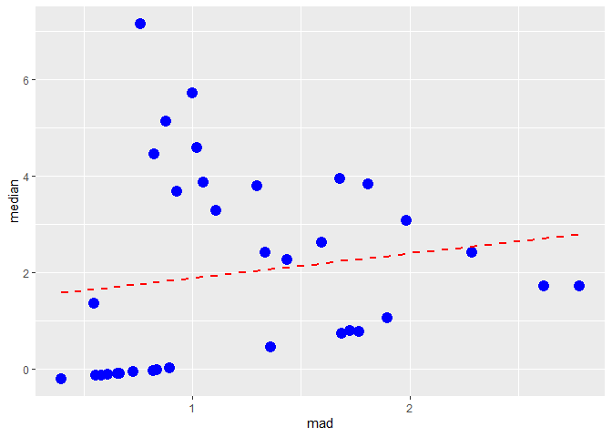

DSC1105 \| FA2
================
Baybayon, Darlyn Antoinette

``` r
library(stringr)
library(tidyverse)
```

    ## ── Attaching core tidyverse packages ──────────────────────── tidyverse 2.0.0 ──
    ## ✔ dplyr     1.1.4     ✔ purrr     1.0.2
    ## ✔ forcats   1.0.0     ✔ readr     2.1.5
    ## ✔ ggplot2   3.5.1     ✔ tibble    3.2.1
    ## ✔ lubridate 1.9.4     ✔ tidyr     1.3.1
    ## ── Conflicts ────────────────────────────────────────── tidyverse_conflicts() ──
    ## ✖ dplyr::filter() masks stats::filter()
    ## ✖ dplyr::lag()    masks stats::lag()
    ## ℹ Use the conflicted package (<http://conflicted.r-lib.org/>) to force all conflicts to become errors

``` r
library(ggplot2)
```

1.  Use pivot_longer to reshape the dataset into one that has two
    columns, the first giving the protein identity and the second giving
    the amount of the protein in one of the cells.

Original dataset

``` r
dataset <- read.csv("cytof_one_experiment.csv")
head(dataset)
```

    ##        NKp30    KIR3DL1      NKp44    KIR2DL1 GranzymeB       CXCR6      CD161
    ## 1  0.1875955  3.6156932 -0.5605694 -0.2936654  2.477893 -0.14470053 -0.3152872
    ## 2  1.0348518  1.7001820 -0.2889611 -0.4798280  3.261016 -0.03392447 -0.4112129
    ## 3  2.9996398  6.1411419  1.9032606  0.4823102  4.277562  1.94654156 -0.5022347
    ## 4  4.2998594 -0.2211586  0.2425707 -0.4831267  3.351808  0.92622195  3.8772370
    ## 5 -0.4386448 -0.5035892 -0.1526320  0.7506128  3.194145 -0.05893640  1.0907379
    ## 6  2.0883050 -0.3992646  3.4550676 -0.5200856  4.345102 -0.36434277 -0.5705891
    ##       KIR2DS4     NKp46      NKG2D      NKG2C       X2B4     CD69 KIR3DL1.S1
    ## 1  1.94497046 4.0818316  2.6200784 -0.3573817 -0.2711557 3.849965 -0.2554637
    ## 2  3.80251714 3.7339299 -0.4832788 -0.4675984 -0.5594752 2.910197 -0.2909482
    ## 3 -0.32010171 4.5594631 -0.5069090  2.6193782 -0.4554785 3.113454  3.6613886
    ## 4 -0.16969487 4.4831486  1.9272290 -0.3110146  1.6350771 3.045998  0.2871241
    ## 5 -0.05033025 0.8379358 -0.4581674  0.9216947  1.2419054 2.644422  0.4218294
    ## 6 -0.45033591 4.0550848  3.4283565  0.6272837 -0.4157104 3.958158  0.7993406
    ##          CD2    KIR2DL5    DNAM.1         CD4        CD8       CD57      TRAIL
    ## 1  5.3529769 -0.5092906 0.8811347 -0.32347280 -0.2822405  3.3254704 -0.6084228
    ## 2  4.3132510  3.7774776 1.5406568 -0.13208167  0.9161920  2.4946442 -0.5034739
    ## 3  5.5969513  0.8128166 1.0005903 -0.59933641  1.8382744  3.9897914 -0.2749380
    ## 4 -0.5002885  0.3612212 1.2663267 -0.12568567  0.7667204  1.9950916 -0.5130930
    ## 5 -0.5479527  1.0638327 0.8722272 -0.07107408 -0.1059012  3.4291302 -0.1433044
    ## 6  5.1028564  3.0918867 0.8717267 -0.47986180 -0.2577198 -0.5784575 -0.5731323
    ##       KIR3DL2      MIP1b     CD107a      GM.CSF       CD16        TNFa
    ## 1 -0.30668543  1.2497120 -0.1295305 -0.43074102  3.9951417  0.90143498
    ## 2 -0.54320954  2.8693060 -0.1887180 -0.16283845  4.4082309  1.93590153
    ## 3  2.06488239  4.0955112 -0.1998480  3.18853825  6.0023244 -0.02336999
    ## 4  2.11247859  3.3726018 -0.5720339  0.91310694  5.8238698 -0.60793749
    ## 5 -0.02505141 -0.3099826 -0.1068511 -0.60370379  4.0122501 -0.61989100
    ## 6 -0.28337673 -0.4108283 -0.1797545 -0.06372458 -0.5832926  0.14311030
    ##           ILT2 Perforin KIR2DL2.L3.S2      KIR2DL3      NKG2A    NTB.A     CD56
    ## 1 -0.386027758 6.431983    1.22710292  2.660657999 -0.5220613 4.348923 2.897523
    ## 2  2.983874845 6.814827   -0.04141081  3.841304627  4.6771149 3.474335 3.782870
    ## 3 -0.521099944 5.099562   -0.16705075 -0.009694396 -0.4730573 5.634341 5.701186
    ## 4 -0.043783559 5.841797   -0.51753289 -0.592990887 -0.4059049 4.598021 6.065672
    ## 5  1.182703288 4.888777   -0.36251589 -0.398123704 -0.5440881 3.606101 1.966169
    ## 6 -0.003258955 3.952542   -0.20194392 -0.202592720  3.8882776 2.346275 6.473243
    ##         INFg
    ## 1 -0.3841108
    ## 2  2.7186296
    ## 3  2.5321763
    ## 4  2.4564582
    ## 5  3.1470092
    ## 6  2.8282987

Long Dataset

``` r
long_dataset <- dataset %>%
  pivot_longer(cols = c("NKp30", "KIR3DL1", "NKp44", "KIR2DL1", "GranzymeB", "CXCR6", "CD161", "KIR2DS4", "NKp46", "NKG2D", "NKG2C", "X2B4", "CD69", "KIR3DL1.S1", "CD2", "KIR2DL5", "DNAM.1", "CD4", "CD8", "CD57", "TRAIL", "KIR3DL2", "MIP1b", "CD107a", "GM.CSF", "CD16", "TNFa", "ILT2", "Perforin", "KIR2DL2.L3.S2", "KIR2DL3", "NKG2A", "NTB.A", "CD56", "INFg"), names_to="protein", values_to="amount")
long_dataset
```

    ## # A tibble: 1,750,000 × 2
    ##    protein   amount
    ##    <chr>      <dbl>
    ##  1 NKp30      0.188
    ##  2 KIR3DL1    3.62 
    ##  3 NKp44     -0.561
    ##  4 KIR2DL1   -0.294
    ##  5 GranzymeB  2.48 
    ##  6 CXCR6     -0.145
    ##  7 CD161     -0.315
    ##  8 KIR2DS4    1.94 
    ##  9 NKp46      4.08 
    ## 10 NKG2D      2.62 
    ## # ℹ 1,749,990 more rows

2.  Use group_by and summarise to find the median protein level and the
    median absolute deviation of the protein level for each marker.

``` r
median_mad <- long_dataset %>%
  group_by(protein) %>%
  summarise(
    median = median(amount),
    mad = mad(amount))
median_mad
```

    ## # A tibble: 35 × 3
    ##    protein  median   mad
    ##    <chr>     <dbl> <dbl>
    ##  1 CD107a  -0.122  0.609
    ##  2 CD16     5.12   0.874
    ##  3 CD161    0.726  1.69 
    ##  4 CD2      3.95   1.68 
    ##  5 CD4     -0.204  0.395
    ##  6 CD56     5.71   0.998
    ##  7 CD57     3.07   1.99 
    ##  8 CD69     4.59   1.02 
    ##  9 CD8      2.40   2.29 
    ## 10 CXCR6   -0.0581 0.727
    ## # ℹ 25 more rows

3.  Make a plot with mad on the x-axis and median on the y-axis. This is
    known as a spreadlocation (s-l) plot. What does it tell you about
    the relationship betwen the median and the mad?

``` r
ggplot(median_mad, aes(x = mad, y = median)) +
  geom_point(size = 4, color = "blue") +
  # geom_text(aes(l), vjust = -1, size = 5) +
  geom_smooth(method = "lm", formula = y ~ x, se = FALSE, color = "red", linetype = "dashed")
```

<!-- -->

The red line shows a positive slope, which suggests a that the Median
increases slightly as the MAD increases. Some outliers can be observed
(high median despite low mad value) which may indicate skewed data.

4.  Using either pivot_longer on its own or pivot_longer in combination
    with separate, reshape the dataset so that it has columns for
    country, event, year, and score.

Original Dataset

``` r
library(dcldata)
example_gymnastics_2
```

    ## # A tibble: 3 × 5
    ##   country       vault_2012 floor_2012 vault_2016 floor_2016
    ##   <chr>              <dbl>      <dbl>      <dbl>      <dbl>
    ## 1 United States       48.1       45.4       46.9       46.0
    ## 2 Russia              46.4       41.6       45.7       42.0
    ## 3 China               44.3       40.8       44.3       42.1

Longer Dataset

``` r
example_gymnastics_2 %>%
  pivot_longer(cols=c("vault_2012", "floor_2012", "vault_2016", "floor_2016"), names_to = "event", values_to="score") %>%
  separate(col="event", into=c("event", "year"), sep="_")
```

    ## # A tibble: 12 × 4
    ##    country       event year  score
    ##    <chr>         <chr> <chr> <dbl>
    ##  1 United States vault 2012   48.1
    ##  2 United States floor 2012   45.4
    ##  3 United States vault 2016   46.9
    ##  4 United States floor 2016   46.0
    ##  5 Russia        vault 2012   46.4
    ##  6 Russia        floor 2012   41.6
    ##  7 Russia        vault 2016   45.7
    ##  8 Russia        floor 2016   42.0
    ##  9 China         vault 2012   44.3
    ## 10 China         floor 2012   40.8
    ## 11 China         vault 2016   44.3
    ## 12 China         floor 2016   42.1
