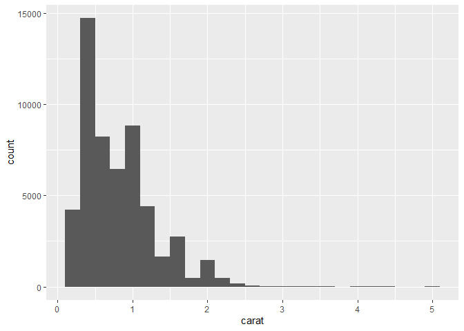
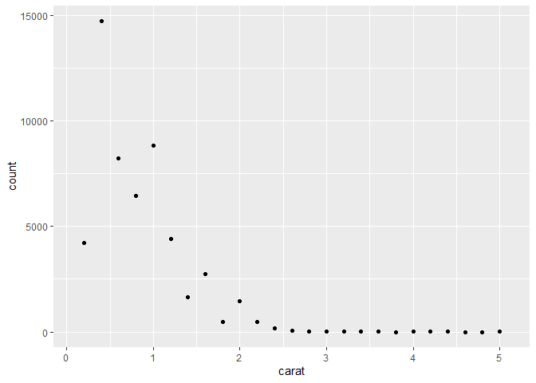
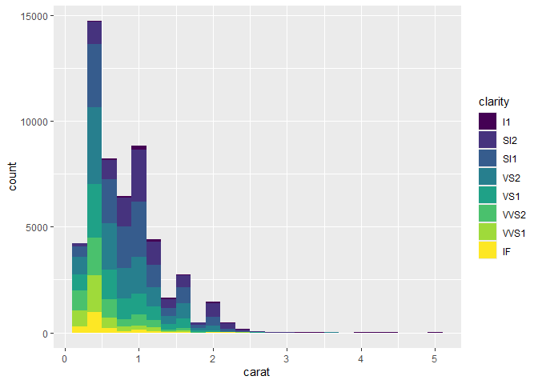
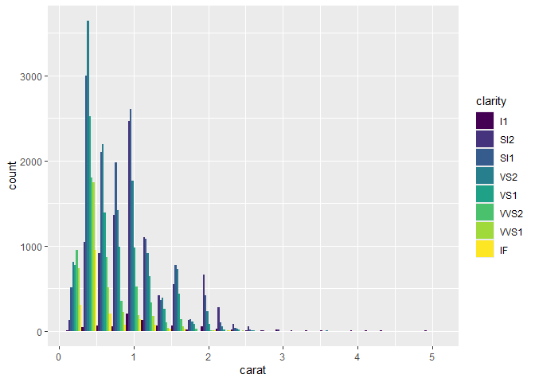

DSC1105 \| FA3
================
Baybayon, Darlyn Antoinette

``` r
suppressPackageStartupMessages({
  library(tidyverse)
  library(ggplot2)
  })
```

1.  Create a histogram on the diamonds dataset.

``` r
ggplot() + geom_histogram(aes(x = carat), data = diamonds, binwidth = 0.2)
```

<!-- -->

Re-write this using the layer function

``` r
ggplot() +
  layer(
    geom = "bar",
    stat = "bin",
    data = diamonds,
    mapping = aes(x = carat),
    position = "stack",
    params = list(binwidth = 0.2)
  )
```

<!-- -->

2.  Modify your histogram code so that it uses a different geom.

``` r
ggplot() +
  layer(
    geom = "point",
    stat = "bin",
    data = diamonds,
    mapping = aes(x = carat),
    position = "stack",
    params = list(binwidth = 0.2)
  )
```

<!-- -->

3.  Add an aesthetic mapping from one of the factor variables.

``` r
ggplot() +
  layer(
    geom = "bar",
    stat = "bin",
    data = diamonds,
    mapping = aes(x = carat, fill = clarity),
    position = "stack",
    params = list(binwidth = 0.2)
  )
```

<!-- -->

4.  What is the default position adjustment for a histogram? Try
    changing the position adjustment in the histogram.

``` r
ggplot() +
  layer(
    geom = "bar",
    stat = "bin",
    data = diamonds,
    mapping = aes(x = carat, fill = clarity),
    position = "dodge",
    params = list(binwidth = 0.2)
  )
```

<!-- -->
