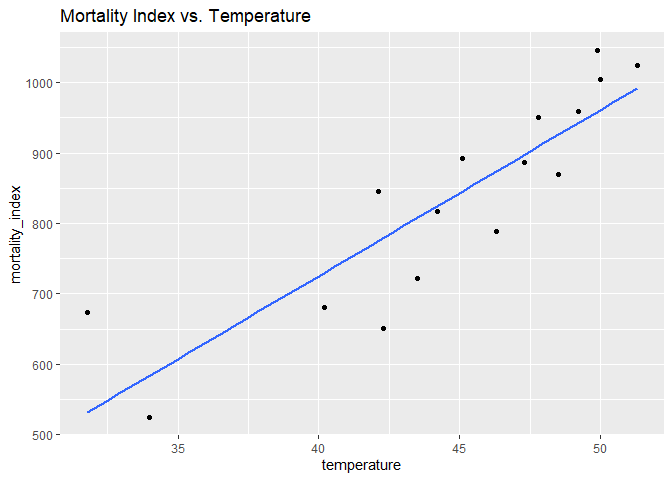

DSC1105 \| FA4
================
Baybayon, Darlyn Antoinette

``` r
suppressPackageStartupMessages({
  library(tidyverse)
  library(ggplot2)
  library(cowplot)
})
```

1.  Using the Mortality by Latitude data, make a plot of mortality index
    against mean average temperature. Is it hollow up or hollow down?
    Try to identify a transformation of one of the variables that will
    straighten out the relationship, and make a plot of the residuals to
    check for any remaining patterns.

``` r
data <- read.csv("mortality_by_latitude.csv")
data
```

    ##    latitude mortality_index temperature
    ## 1        50            1025        51.3
    ## 2        51            1045        49.9
    ## 3        52            1004        50.0
    ## 4        53             959        49.2
    ## 5        54             870        48.5
    ## 6        55             950        47.8
    ## 7        56             886        47.3
    ## 8        57             892        45.1
    ## 9        58             789        46.3
    ## 10       59             846        42.1
    ## 11       60             817        44.2
    ## 12       61             722        43.5
    ## 13       62             651        42.3
    ## 14       63             681        40.2
    ## 15       69             673        31.8
    ## 16       70             525        34.0

``` r
ggplot(data, aes(x= temperature, y=mortality_index)) + geom_point() +
  stat_smooth(method = "lm", formula = y ~ x,se=FALSE) +
  labs(title= "Mortality Index vs. Temperature")
```

<!-- -->

``` r
ggplot(data, aes(x = temperature, y = log(mortality_index))) +
  geom_point() +
  stat_smooth(method = "lm", formula = y ~ x, se = FALSE) +
  labs(title="Log(Mortality Index) vs. Temperature")
```

<!-- -->

``` r
model_log <- lm(log(mortality_index) ~ temperature, data = data)


ggplot(data, aes(x = temperature, y = resid(model_log))) +
  geom_point() +
  geom_hline(yintercept = 0, linetype = "dashed", color = "red") +
  labs(y = "Residuals", x = "Temperature", title = "Residual Plot")
```

<!-- -->

2.  Using the same subset of the diamonds dataset, make a plot of log
    price as a function of carat with a loess smoother. Try several
    values for the span and degree arguments and comment briefly about
    your choice.

``` r
diamond_plot <- ggplot(subset(diamonds, clarity == "VS1"), aes(x=carat, y=log(price))) +
  geom_point(size=0.5) 
  
diamond_plot + geom_smooth(method = "loess", se=FALSE, formula = y~x, span= 0.2, color="red") + 
labs(title="Span=0.2")
```

<!-- -->

``` r
diamond_plot + geom_smooth(method = "loess", se=FALSE, formula = y~x, span= 0.5, color="red") + 
labs(title="Span=0.5")
```

<!-- -->

``` r
diamond_plot + geom_smooth(method = "loess", se=FALSE, formula = y~x, span= 0.8, color="red") +
labs(title="Span=0.8")
```

<!-- -->

I tested three spans, 0.2, 0.5, and 0.8. 0.2 follows a jagged line, 0.5
is comparably smoother while still showing the trends on the plot, and
0.8 is the smoothest. Among these values, 0.5 may be the best fit.

3.  Compare the fit of the loess smoother to the fit of the polynomial +
    step function regression using a plot of the residuals in the two
    models. Which one is more faithful to the data?

``` r
# POLY STEP
step = function(x, step_position) {
    return(ifelse(x >= step_position, 1, 0))
}
lm_poly_step <- lm(log(price) ~ poly(carat, 3) + step(carat, c(0.3, 0.5, 1, 1.5, 2)), 
                   data = diamonds, subset = clarity == "VS1")

diamonds_poly_step <- subset(diamonds, clarity == "VS1") %>%
  mutate(poly_step_fitted = predict(lm_poly_step),
         poly_step_residual = log(price) - poly_step_fitted)


# LOESS
loess_fit <- loess(log(price) ~ carat, data = subset(diamonds, clarity == "VS1"), span = 0.2)

diamonds_loess <- subset(diamonds, clarity == "VS1") %>%
  mutate(loess_fitted = predict(loess_fit),
         loess_residual = log(price) - loess_fitted)

step_poly_plot <- ggplot(diamonds_poly_step, aes(x = carat, y = poly_step_residual)) +
  geom_point(size=0.75) +
  geom_hline(yintercept = 0, linetype = "dashed", color = "red") +
  ggtitle("Residuals: Poly + Step Function Regression")

loess_plot <- ggplot(diamonds_loess, aes(x = carat, y = loess_residual)) +
  geom_point(size=0.75) +
  geom_hline(yintercept = 0, linetype = "dashed", color = "red") +
  ggtitle("Residuals: Loess Smoother")


plot_grid(step_poly_plot, loess_plot)
```

<!-- -->

Both models show residuals scattered around zero without strong
patterns. Between these two, loess is more likely to follow the trends
of the data smoothly compared to the poly + step function regression.
