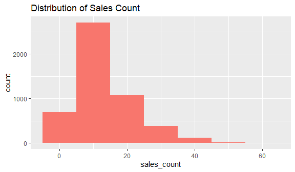
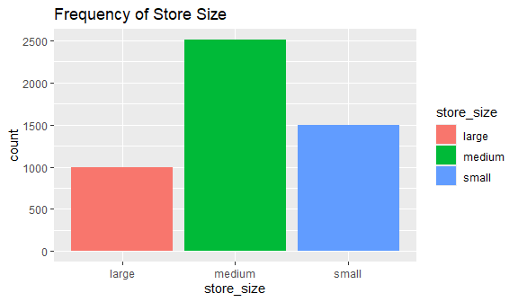
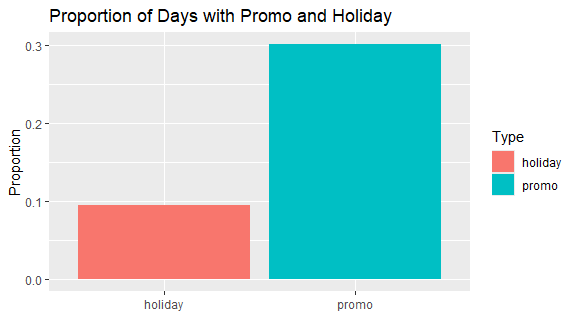

DSC1105 \| FA 5
================
Baybayon, Darlyn Antoinette B.

``` r
suppressPackageStartupMessages({
  library(tidyverse)
  library(dplyr)
  library(readr)
  library(ggplot2)
  library(MASS)
  library(caret)
  library(glmnet)
  library(cowplot)
  library(psych)
})
```

### Load and Explore the Data

``` r
sales_data <- read_csv("store_sales_data.csv", show_col_types = FALSE)
head(sales_data)
```

    ## # A tibble: 6 × 5
    ##   day_of_week promo holiday store_size sales_count
    ##         <dbl> <dbl>   <dbl> <chr>            <dbl>
    ## 1           6     0       0 medium              18
    ## 2           3     0       0 medium              13
    ## 3           4     0       0 large               24
    ## 4           6     1       0 small               16
    ## 5           2     0       0 medium              11
    ## 6           4     0       1 medium              13

**Summary statistics and Variable types**

``` r
summary(sales_data)
```

    ##   day_of_week        promo           holiday        store_size       
    ##  Min.   :0.000   Min.   :0.0000   Min.   :0.0000   Length:5000       
    ##  1st Qu.:1.000   1st Qu.:0.0000   1st Qu.:0.0000   Class :character  
    ##  Median :3.000   Median :0.0000   Median :0.0000   Mode  :character  
    ##  Mean   :2.985   Mean   :0.3012   Mean   :0.0956                     
    ##  3rd Qu.:5.000   3rd Qu.:1.0000   3rd Qu.:0.0000                     
    ##  Max.   :6.000   Max.   :1.0000   Max.   :1.0000                     
    ##   sales_count   
    ##  Min.   : 0.00  
    ##  1st Qu.: 7.00  
    ##  Median :12.00  
    ##  Mean   :13.73  
    ##  3rd Qu.:18.00  
    ##  Max.   :61.00

``` r
glimpse(sales_data)
```

    ## Rows: 5,000
    ## Columns: 5
    ## $ day_of_week <dbl> 6, 3, 4, 6, 2, 4, 4, 6, 1, 2, 6, 2, 2, 4, 3, 2, 5, 4, 1, 3…
    ## $ promo       <dbl> 0, 0, 0, 1, 0, 0, 0, 1, 1, 1, 1, 0, 1, 1, 0, 1, 0, 0, 0, 0…
    ## $ holiday     <dbl> 0, 0, 0, 0, 0, 1, 0, 0, 0, 0, 0, 0, 0, 0, 0, 0, 0, 0, 0, 0…
    ## $ store_size  <chr> "medium", "medium", "large", "small", "medium", "medium", …
    ## $ sales_count <dbl> 18, 13, 24, 16, 11, 13, 12, 34, 19, 8, 22, 10, 22, 9, 3, 1…

The dataset, sales_data, contains 5,000 observations of simulated daily
store sales. It has the following columns:  

- day_of_the week - categorical; 0,1,2,…,6 for each day of the week
  (Sunday-Saturday)
- promo - categorical; binary 1,0
- holiday - categorical; binary 1,0
- store_size - categorical; levels: small, medium, large
- sales_count - numerical; no. of sales for the day  

Convert the columns to the appropriate data types.

``` r
sales_data <- sales_data %>%
  mutate(across(c(day_of_week, promo, holiday, store_size), as.factor))

head(sales_data)
```

    ## # A tibble: 6 × 5
    ##   day_of_week promo holiday store_size sales_count
    ##   <fct>       <fct> <fct>   <fct>            <dbl>
    ## 1 6           0     0       medium              18
    ## 2 3           0     0       medium              13
    ## 3 4           0     0       large               24
    ## 4 6           1     0       small               16
    ## 5 2           0     0       medium              11
    ## 6 4           0     1       medium              13

**Exploration of distribution of sales_count, store_size, and proportion
of days with promo and holiday.**

``` r
ggplot(sales_data, aes(x=sales_count)) +
  geom_histogram(binwidth = 10, fill="#F8766D") + 
  labs(title= "Distribution of Sales Count")
```

<!-- -->

``` r
ggplot(sales_data, aes(x= store_size)) + 
  geom_bar(aes(fill=store_size)) + 
  labs(title="Frequency of Store Size")
```

<!-- -->

``` r
sales_data %>%
  summarise(
    promo = mean(promo == 1),
    holiday = mean(holiday == 1)
  ) %>% pivot_longer(
    cols = c(promo, holiday), 
    names_to = "Type", values_to = "Proportion") %>%
  ggplot(aes(x = Type, y = Proportion, fill = Type)) +
  geom_bar(stat = "identity") +
  labs(title = "Proportion of Days with Promo and Holiday",
       x = "",
       y = "Proportion")
```

<!-- -->

### Fit a Poisson Regression Model 

**Poisson Model**  
Take sales_count as the outcome and days_of_week, promo, holiday, and
store_size as predictors.

``` r
poisson_model <- glm(sales_count ~ day_of_week+promo+holiday+store_size, 
                     family=poisson, data = sales_data)

summary(poisson_model)
```

    ## 
    ## Call:
    ## glm(formula = sales_count ~ day_of_week + promo + holiday + store_size, 
    ##     family = poisson, data = sales_data)
    ## 
    ## Coefficients:
    ##                   Estimate Std. Error  z value Pr(>|z|)    
    ## (Intercept)       2.986855   0.012142  245.993  < 2e-16 ***
    ## day_of_week1      0.060625   0.015432    3.929 8.55e-05 ***
    ## day_of_week2      0.126883   0.014958    8.482  < 2e-16 ***
    ## day_of_week3      0.165142   0.014575   11.330  < 2e-16 ***
    ## day_of_week4      0.191823   0.014597   13.141  < 2e-16 ***
    ## day_of_week5      0.270251   0.014227   18.996  < 2e-16 ***
    ## day_of_week6      0.315462   0.014331   22.012  < 2e-16 ***
    ## promo1            0.410422   0.007820   52.485  < 2e-16 ***
    ## holiday1         -0.330349   0.014945  -22.105  < 2e-16 ***
    ## store_sizemedium -0.697036   0.008311  -83.868  < 2e-16 ***
    ## store_sizesmall  -1.395325   0.011884 -117.416  < 2e-16 ***
    ## ---
    ## Signif. codes:  0 '***' 0.001 '**' 0.01 '*' 0.05 '.' 0.1 ' ' 1
    ## 
    ## (Dispersion parameter for poisson family taken to be 1)
    ## 
    ##     Null deviance: 25307.2  on 4999  degrees of freedom
    ## Residual deviance:  5134.7  on 4989  degrees of freedom
    ## AIC: 26509
    ## 
    ## Number of Fisher Scoring iterations: 4

**Model Summary**  

*What happens to expected sales when there’s a promotion?*

The sales count increases when there’s a promotion. With a promotion,
the expected sales count increases by a factor of
$e^{0.410422}\approx1.507$.

*How does store size affect expected sales?*

Store size affects expected sales negatively. Smaller stores generate
less sales. If a store is medium sized, its sales count would be about
$e^{-0.697036}\approx0.498$ or 49.8% of the expected sales of large
stores. Meanwhile, a small sized store would have
$e^{-1.395325}\approx0.2478$ or 24.78% of the expected sales of large
stores.

### Assess Model Fit 

Check for overdispersion

``` r
deviance(poisson_model) / df.residual(poisson_model)
```

    ## [1] 1.029194

The ratio is 1.029, hence no significant overdispersion. This Poisson
model is appropriate.

### Make Predictions 

Predict expected sales for a medium store on a Monday with a promotion
and no holiday.

``` r
exp(2.986855 + 0.060625 + -0.697036 + 0.410422 + 0) 
```

    ## [1] 15.81353

About 15.81 sales would be expected on a medium store on a Monday with a
promo and no holiday.  

Predict sales for a large store on a Sunday with no promotion and a
holiday.

``` r
exp(2.986855 + 0 + 0 -0.330349)
```

    ## [1] 14.24643

About 14.25 sales would be expected on a Sunday with no promo and a
holiday.

The second scenario expected less sales than the former since higher
sales are usually seen on Monday-Saturday (positive coefficients) and
holidays (negative coefficient) affect sales negatively.  

### Reflection 

A poisson regression model was used to fit the data and predict daily
sales count of stores with the following predictors: day of the week,
store size, promotions, and holidays. To assess model fit,
overdispersion was checked by calculating the ratio of residual deviance
(5134.7) to the residual degrees of freedom (4989) resulting to a result
of 1.03, indicating no significant overdispersion, and suggesting that
the model provides an adequate fit to the data. Among the predictors,
store size appears to have the strongest impact on expected sales. Small
store size, in particular, has the largest coefficient of -1.395, which
indicates substantial decrease in sales compared to larger stores. One
of the primary limitations of the poisson distribution is its assumption
that the mean is equal the variance. However, this is often not the case
for real-world scenarios, where using poisson models can yield biased
estimates. This model is also limited by the predictors available. Other
potentially influential factors not included in the dataset, such as
store location, is not explained by this model.
