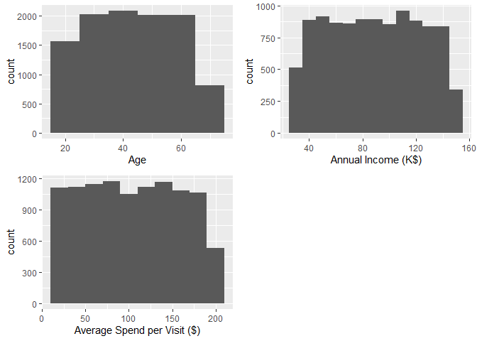
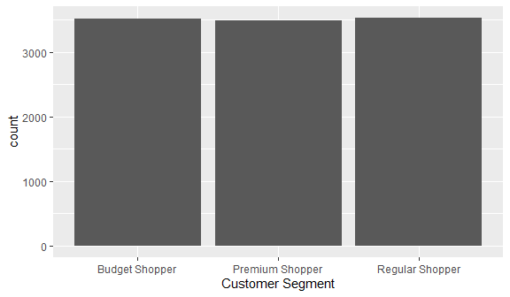
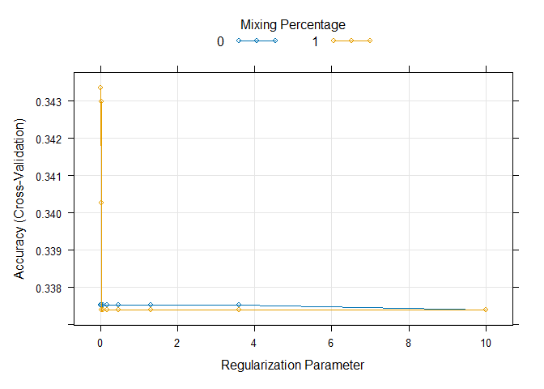
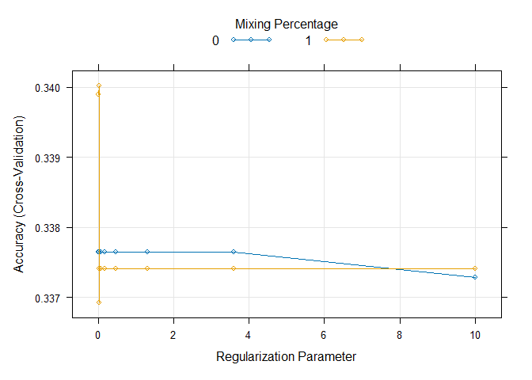

DSC1105 \| FA 6
================
Baybayon, Darlyn Antoinette B.

``` r
suppressPackageStartupMessages({
  library(tidyverse)
  library(dplyr)
  library(readr)
  library(ggplot2)
  library(glmnet)
  library(nnet)
  library(caret)
  library(cowplot)
  library(broom)
  library(psych)
  library(VGAM)
})
```

### Data Exploration

**The dataset and variables**

``` r
data <- read_csv("customer_segmentation.csv", show_col_types = FALSE)
head(data)
```

    ## # A tibble: 6 × 8
    ##   `Customer ID`   Age `Annual Income (K$)` Gender `Product Category Purchased`
    ##           <dbl> <dbl>                <dbl> <chr>  <chr>                       
    ## 1             1    56                  106 Female Fashion                     
    ## 2             2    69                   66 Female Home                        
    ## 3             3    46                  110 Male   Fashion                     
    ## 4             4    32                   50 Male   Electronics                 
    ## 5             5    60                   73 Female Others                      
    ## 6             6    25                   48 Male   Home                        
    ## # ℹ 3 more variables: `Average Spend per Visit ($)` <dbl>,
    ## #   `Number of Visits in Last 6 Months` <dbl>, `Customer Segment` <chr>

``` r
glimpse(data)
```

    ## Rows: 10,532
    ## Columns: 8
    ## $ `Customer ID`                       <dbl> 1, 2, 3, 4, 5, 6, 7, 8, 9, 10, 11,…
    ## $ Age                                 <dbl> 56, 69, 46, 32, 60, 25, 38, 56, 36…
    ## $ `Annual Income (K$)`                <dbl> 106, 66, 110, 50, 73, 48, 100, 131…
    ## $ Gender                              <chr> "Female", "Female", "Male", "Male"…
    ## $ `Product Category Purchased`        <chr> "Fashion", "Home", "Fashion", "Ele…
    ## $ `Average Spend per Visit ($)`       <dbl> 163.45276, 163.02050, 104.54128, 1…
    ## $ `Number of Visits in Last 6 Months` <dbl> 16, 31, 29, 26, 38, 22, 20, 33, 34…
    ## $ `Customer Segment`                  <chr> "Premium Shopper", "Budget Shopper…

The dataset contains customer segmentation information based on
purchasing behavior. The goal of this project is to predict which
customer segment a new customer would belong to given their demographic
and behavioral data.

The dataset has 10,352 observations and 8 columns:  

- Customer ID (unique identifier
- Age (continuous)
- Annual Income (continuous: in thousands of \$)
- Gender (categorical: male/female)
- Product Category Purchased (categorical: electronics, fashion, home,
  books, others)
- Average Spend per Visit (continuous: in \$)
- No. of Visits in Last 6 Months (discrete)
- Customer Segment (categorical, target: Budget shopper, Regular
  shopper, Premum shopper)

Visualization

``` r
plot_grid(
  ggplot(data, aes(x=Age)) + geom_histogram(binwidth = 10),
  ggplot(data, aes(x=`Annual Income (K$)`)) + geom_histogram(binwidth = 10),
  ggplot(data, aes(x= `Average Spend per Visit ($)`)) + geom_histogram(binwidth = 20),
  ncol=2
)
```

<!-- -->

Check missing values

``` r
sapply(data, function(x) sum(is.na(x)))
```

    ##                       Customer ID                               Age 
    ##                                 0                                 0 
    ##                Annual Income (K$)                            Gender 
    ##                                 0                                 0 
    ##        Product Category Purchased       Average Spend per Visit ($) 
    ##                                 0                                 0 
    ## Number of Visits in Last 6 Months                  Customer Segment 
    ##                                 0                                 0

Distribution of Customer Segment

``` r
ggplot(data, aes(x=`Customer Segment`)) + geom_bar()
```

<!-- -->

### Data Preprocessing

Encode the Gender and Product Category Purchased columns using
appropriate encoding methods (e.g., One-Hot Encoding for the product
category, Label Encoding for gender).

Scale continuous variables like Age, Annual Income, and Average Spend
per Visit using StandardScaler or MinMaxScaler.

``` r
data_clean <- data %>%
  select(-`Customer ID`) %>%
  mutate(
    Gender = factor(as.numeric(factor(Gender))),
    `Product Category Purchased` = factor(as.numeric(factor(`Product Category Purchased`))),
    `Customer Segment` = factor(`Customer Segment`,
                                levels = c("Budget Shopper", "Regular Shopper", "Premium Shopper"),
                                labels = c(1, 2, 3)),
    across(c(Age, `Average Spend per Visit ($)`, `Annual Income (K$)`, `Number of Visits in Last 6 Months`), scale)
    
  )

data_clean
```

    ## # A tibble: 10,532 × 7
    ##    Age[,1] `Annual Income (K$)`[,1] Gender `Product Category Purchased`
    ##      <dbl>                    <dbl> <fct>  <fct>                       
    ##  1   0.832                    0.489 1      3                           
    ##  2   1.70                    -0.674 1      4                           
    ##  3   0.161                    0.605 2      3                           
    ##  4  -0.778                   -1.14  2      2                           
    ##  5   1.10                    -0.470 1      5                           
    ##  6  -1.25                    -1.20  2      4                           
    ##  7  -0.375                    0.314 2      2                           
    ##  8   0.832                    1.22  2      1                           
    ##  9  -0.509                   -1.52  1      1                           
    ## 10  -0.241                    0.489 1      3                           
    ## # ℹ 10,522 more rows
    ## # ℹ 3 more variables: `Average Spend per Visit ($)` <dbl[,1]>,
    ## #   `Number of Visits in Last 6 Months` <dbl[,1]>, `Customer Segment` <fct>

Split the dataset into training and testing sets

``` r
set.seed(123)

n <- nrow(data_clean)
train_samples <- sample(1:n, round(0.8*n))

data_train <- data_clean[train_samples, ]
data_test <- data_clean[-train_samples, ]
```

### Model Building

``` r
mlr_model <- vglm(`Customer Segment` ~ .,
                  family = multinomial,
                  data = data_train)
summary(mlr_model)
```

    ## 
    ## Call:
    ## vglm(formula = `Customer Segment` ~ ., family = multinomial, 
    ##     data = data_train)
    ## 
    ## Coefficients: 
    ##                                        Estimate Std. Error z value Pr(>|z|)    
    ## (Intercept):1                          0.166124   0.063861   2.601 0.009286 ** 
    ## (Intercept):2                          0.055003   0.065686   0.837 0.402387    
    ## Age:1                                 -0.009720   0.026773  -0.363 0.716568    
    ## Age:2                                  0.003192   0.026831   0.119 0.905301    
    ## `Annual Income (K$)`:1                 0.012810   0.026778   0.478 0.632368    
    ## `Annual Income (K$)`:2                -0.010360   0.026837  -0.386 0.699476    
    ## Gender2:1                              0.015488   0.053485   0.290 0.772136    
    ## Gender2:2                             -0.083608   0.053601  -1.560 0.118803    
    ## `Product Category Purchased`2:1       -0.145480   0.084606  -1.720 0.085523 .  
    ## `Product Category Purchased`2:2        0.015470   0.086160   0.180 0.857505    
    ## `Product Category Purchased`3:1       -0.283452   0.084732  -3.345 0.000822 ***
    ## `Product Category Purchased`3:2       -0.037011   0.085346  -0.434 0.664539    
    ## `Product Category Purchased`4:1       -0.180064   0.084007  -2.143 0.032077 *  
    ## `Product Category Purchased`4:2       -0.021034   0.085589  -0.246 0.805868    
    ## `Product Category Purchased`5:1       -0.141248   0.082496  -1.712 0.086865 .  
    ## `Product Category Purchased`5:2        0.051574   0.083770   0.616 0.538116    
    ## `Average Spend per Visit ($)`:1       -0.002502   0.026754  -0.094 0.925496    
    ## `Average Spend per Visit ($)`:2       -0.038573   0.026822  -1.438 0.150404    
    ## `Number of Visits in Last 6 Months`:1  0.036348   0.026821   1.355 0.175344    
    ## `Number of Visits in Last 6 Months`:2  0.003277   0.026860   0.122 0.902895    
    ## ---
    ## Signif. codes:  0 '***' 0.001 '**' 0.01 '*' 0.05 '.' 0.1 ' ' 1
    ## 
    ## Names of linear predictors: log(mu[,1]/mu[,3]), log(mu[,2]/mu[,3])
    ## 
    ## Residual deviance: 18488.18 on 16832 degrees of freedom
    ## 
    ## Log-likelihood: -9244.088 on 16832 degrees of freedom
    ## 
    ## Number of Fisher scoring iterations: 3 
    ## 
    ## No Hauck-Donner effect found in any of the estimates
    ## 
    ## 
    ## Reference group is level  3  of the response

Significant predictors (p \< 0.05) (Intercept):1 (B = 0.166, p = 0.009)
`Product Category Purchased`3:1 (B = -0.283, p = 0.001)
`Product Category Purchased`4:1 (B = -0.180, p = 0.032)

Marginally significant predictors (p \< 0.1)
`Product Category Purchased`2:1 (B = -0.145, p = 0.086)
`Product Category Purchased`5:1 (B = -0.141, p = 0.087)

These results suggest that Product Category has the strongest impact in
differentiating Customer Segments compared to other features. Those who
purchased Category 3 (Fashion) are significantly less likely to be in
Segment 1 (Budget Shopper).

``` r
predicted <- predict(mlr_model, newdata = data_test, type = "response")
predicted_classes <- factor(colnames(predicted)[apply(predicted, 1, which.max)])

actual <- factor(data_test$`Customer Segment`)
cf <- confusionMatrix(actual, predicted_classes)
cf$table
```

    ##           Reference
    ## Prediction   1   2   3
    ##          1 284 227 162
    ##          2 308 268 142
    ##          3 290 286 139

``` r
accuracy <- cf$overall["Accuracy"]
precision <- cf$byClass[,"Specificity"]
recall <- cf$byClass[,"Sensitivity"]
f1_score <- cf$byClass[,"F1"]

data.frame(
  Metric = c("Accuracy", "Precision", "Recall", "F-1 Score"),
  Value = c(accuracy, mean(precision), mean(recall), mean(f1_score))
)
```

    ##      Metric     Value
    ## 1  Accuracy 0.3281102
    ## 2 Precision 0.6654016
    ## 3    Recall 0.3263050
    ## 4 F-1 Score 0.3209714

Tune hyperparameters like regularization strength (C) using
cross-validation.

``` r
train_control <- trainControl(method = "cv", number = 5)
tune_grid <- expand.grid(
  alpha = c(0, 1),
  lambda = 10^seq(-3, 1, length.out = 10) 
)

cv_model <- train(`Customer Segment` ~., data = data_train, 
               method = "glmnet",
               family = "multinomial",
               trControl = train_control,
               tuneGrid = tune_grid
               )
plot(cv_model)
```

<!-- -->

``` r
cv_model$bestTune
```

    ##    alpha lambda
    ## 11     1  0.001

``` r
predict_tuned <- predict(cv_model, newdata = data_test)
```

### Model Evaluation

``` r
cf <- confusionMatrix(actual, predict_tuned)
cf$table
```

    ##           Reference
    ## Prediction   1   2   3
    ##          1 317 228 128
    ##          2 340 263 115
    ##          3 328 276 111

``` r
accuracy <- cf$overall["Accuracy"]
precision <- cf$byClass[,"Specificity"]
recall <- cf$byClass[,"Sensitivity"]
f1_score <- cf$byClass[,"F1"]

data.frame(
  Metric = c("Accuracy", "Precision", "Recall", "F-1 Score"),
  Value = c(accuracy, mean(precision), mean(recall), mean(f1_score))
)
```

    ##      Metric     Value
    ## 1  Accuracy 0.3281102
    ## 2 Precision 0.6659572
    ## 3    Recall 0.3260937
    ## 4 F-1 Score 0.3147560

``` r
coef(cv_model$finalModel, s=cv_model$bestTune$lambda)
```

    ## $`1`
    ## 10 x 1 sparse Matrix of class "dgCMatrix"
    ##                                                1
    ## (Intercept)                          0.072713825
    ## Age                                 -0.006767148
    ## `Annual Income (K$)`                 0.009327799
    ## Gender2                              0.008574917
    ## `Product Category Purchased`2       -0.104610397
    ## `Product Category Purchased`3       -0.204994985
    ## `Product Category Purchased`4       -0.118386563
    ## `Product Category Purchased`5       -0.101257198
    ## `Average Spend per Visit ($)`        .          
    ## `Number of Visits in Last 6 Months`  0.029731845
    ## 
    ## $`2`
    ## 10 x 1 sparse Matrix of class "dgCMatrix"
    ##                                                 1
    ## (Intercept)                         -0.0101521072
    ## Age                                  0.0002247762
    ## `Annual Income (K$)`                -0.0074498638
    ## Gender2                             -0.0778929182
    ## `Product Category Purchased`2        0.0094394002
    ## `Product Category Purchased`3        .           
    ## `Product Category Purchased`4        .           
    ## `Product Category Purchased`5        0.0457998333
    ## `Average Spend per Visit ($)`       -0.0328398099
    ## `Number of Visits in Last 6 Months`  .           
    ## 
    ## $`3`
    ## 10 x 1 sparse Matrix of class "dgCMatrix"
    ##                                                 1
    ## (Intercept)                         -0.0625617176
    ## Age                                  .           
    ## `Annual Income (K$)`                 .           
    ## Gender2                              .           
    ## `Product Category Purchased`2        .           
    ## `Product Category Purchased`3        0.0312673436
    ## `Product Category Purchased`4        0.0150865672
    ## `Product Category Purchased`5        .           
    ## `Average Spend per Visit ($)`        .           
    ## `Number of Visits in Last 6 Months` -0.0002543989

### Refinement

Try to improve the model by adding interaction features (e.g., combining
Annual Income and Age), or by tuning the hyperparameters further.

``` r
cv_model_refined <- train(`Customer Segment` ~ Age + Gender + `Average Spend per Visit ($)`+
                             `Annual Income (K$)`+ `Number of Visits in Last 6 Months` + 
                             `Product Category Purchased` + `Age`:`Annual Income (K$)`,
                  data = data_train,
                  method = "glmnet",
                  family = "multinomial",
                  trControl = train_control,
                  tuneGrid = tune_grid)

plot(cv_model_refined)
```

<!-- -->

``` r
cv_model_refined$bestTune
```

    ##    alpha      lambda
    ## 12     1 0.002782559

``` r
predict_refined <- predict(cv_model_refined, newdata = data_test)
```

``` r
cf_refined <- confusionMatrix(actual, predict_refined)
cf_refined$table
```

    ##           Reference
    ## Prediction   1   2   3
    ##          1 376 210  87
    ##          2 422 217  79
    ##          3 392 249  74

``` r
accuracy <- cf_refined$overall["Accuracy"]
precision <- cf_refined$byClass[,"Specificity"]
recall <- cf_refined$byClass[,"Sensitivity"]
f1_score <- cf_refined$byClass[,"F1"]

data.frame(
  Metric = c("Accuracy", "Precision", "Recall", "F-1 Score"),
  Value = c(accuracy, mean(precision), mean(recall), mean(f1_score))
)
```

    ##      Metric     Value
    ## 1  Accuracy 0.3167142
    ## 2 Precision 0.6606330
    ## 3    Recall 0.3151019
    ## 4 F-1 Score 0.2899860

``` r
coef(cv_model_refined$finalModel, s=cv_model_refined$bestTune$lambda)
```

    ## $`1`
    ## 11 x 1 sparse Matrix of class "dgCMatrix"
    ##                                                1
    ## (Intercept)                          0.036450900
    ## Age                                  .          
    ## Gender2                              .          
    ## `Average Spend per Visit ($)`        .          
    ## `Annual Income (K$)`                 0.003215893
    ## `Number of Visits in Last 6 Months`  0.021180741
    ## `Product Category Purchased`2       -0.031009753
    ## `Product Category Purchased`3       -0.131655087
    ## `Product Category Purchased`4       -0.046382870
    ## `Product Category Purchased`5       -0.029046240
    ## Age:`Annual Income (K$)`             .          
    ## 
    ## $`2`
    ## 11 x 1 sparse Matrix of class "dgCMatrix"
    ##                                                1
    ## (Intercept)                          0.004712554
    ## Age                                  .          
    ## Gender2                             -0.065629703
    ## `Average Spend per Visit ($)`       -0.024866322
    ## `Annual Income (K$)`                -0.002125019
    ## `Number of Visits in Last 6 Months`  .          
    ## `Product Category Purchased`2        .          
    ## `Product Category Purchased`3        .          
    ## `Product Category Purchased`4        .          
    ## `Product Category Purchased`5        0.036376218
    ## Age:`Annual Income (K$)`             0.002666269
    ## 
    ## $`3`
    ## 11 x 1 sparse Matrix of class "dgCMatrix"
    ##                                                1
    ## (Intercept)                         -0.041163454
    ## Age                                  .          
    ## Gender2                              .          
    ## `Average Spend per Visit ($)`        .          
    ## `Annual Income (K$)`                 .          
    ## `Number of Visits in Last 6 Months`  .          
    ## `Product Category Purchased`2        .          
    ## `Product Category Purchased`3        0.019978641
    ## `Product Category Purchased`4        0.003352293
    ## `Product Category Purchased`5        .          
    ## Age:`Annual Income (K$)`             .

Customer Segment 1 (Budget Shoppers) are least likely to spend on
Category 3 (Fashion). Higher Annual Income slightly affects their
probability to be classified here.

Customer Segment 2 (Regular Shoppers) are less likely to be Gender 2
(Male) and high spender per visit and more likely to spend on Category 5
(others).

Customer Segment 3 (Premium Shoppers) are more positively associated
with Category 3 (Fashion).

### Reporting

A multinomial logistic regression model was trained to predict Customer
Segment based on Age, Gender, Average Spend per Visit (\$), Annual
Income (K\$), Number of Visits in Last 6 Months, and Product Category
Purchased.

The initial model found Product Category Purchased to be the strongest
factor in predicting Customer Segments. In particular, the results
suggest that those who purchased from Category 3 (Fashion) are
significantly less likely to be classified as Segment 1 (Budget
Shopper). This model reported an accuracy of 0.3281, precision 0.6654,
recall, and f-1 score of 0.321.

The model was refined by adding interaction features (Annual Income and
Age) and running a 5-fold cross-validation to tune the hyperparameters
to reach optimal performance. A grid search was conducted to determine
the best regularization method (0 = ridge, 1 = lasso) and regularization
strength. The final model also determine Product Categories to be the
more significant feature for classifying Customer Segments. This model
reported an accuracy of 0.3234, precision of 0.6634, recall 0.3211, and
f-1 score of 0.3111. The initial model reported slightly better
performance metrics even after some refinements.

In conclusion, most of the features did not exhibit a strong influence
on Customer Segmentation. To improve this model, using other predictors
may yield better results.
