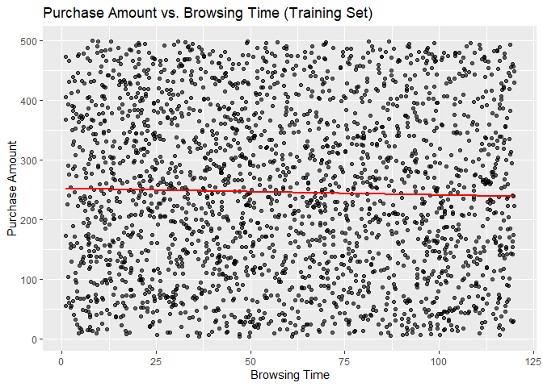
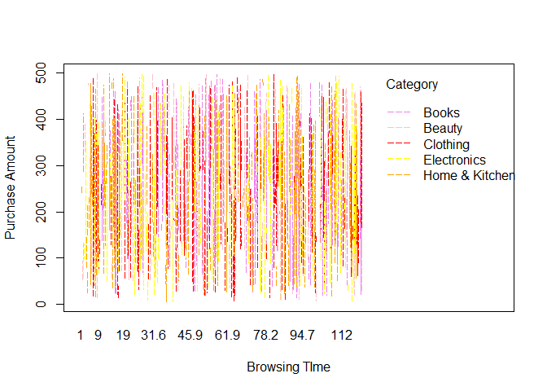

DSC1105_SA1_BAYBAYON
================
Baybayon, Darlyn Antoinette B.

``` r
suppressPackageStartupMessages({
  library(tidyverse)
  library(dplyr)
  library(readr)
  library(ggplot2)
  library(stat471)
  library(caret)
  library(glmnet)
  library(cowplot)
  library(modeest)
  library(lattice)
  library(broom)
  library(faraway)
  library(MASS)
  library(broom)
})
```

### Unit 1: Univariate Data Analysis

Load the dataset and summarize its structure.

``` r
dataset <- read_csv("EDA_Ecommerce_Assessment.csv", show_col_types = FALSE)
dataset
```

    ## # A tibble: 3,000 × 10
    ##    Customer_ID Gender   Age Browsing_Time Purchase_Amount Number_of_Items
    ##          <dbl> <chr>  <dbl>         <dbl>           <dbl>           <dbl>
    ##  1           1 Male      65          46.6           232.                6
    ##  2           2 Female    19          98.8           473.                8
    ##  3           3 Male      23          79.5           338.                1
    ##  4           4 Male      45          95.8            37.1               7
    ##  5           5 Male      46          33.4           236.                3
    ##  6           6 Female    43          83.4           124.                9
    ##  7           7 Male      42          32.4           238.                6
    ##  8           8 Male      29         113.            230.                5
    ##  9           9 Male      22          76.7           293.                8
    ## 10          10 Female    51          39.6           182.                8
    ## # ℹ 2,990 more rows
    ## # ℹ 4 more variables: Discount_Applied <dbl>, Total_Transactions <dbl>,
    ## #   Category <chr>, Satisfaction_Score <dbl>

``` r
summary(dataset)
```

    ##   Customer_ID        Gender               Age        Browsing_Time   
    ##  Min.   :   1.0   Length:3000        Min.   :18.00   Min.   :  1.00  
    ##  1st Qu.: 750.8   Class :character   1st Qu.:31.00   1st Qu.: 29.98  
    ##  Median :1500.5   Mode  :character   Median :44.00   Median : 59.16  
    ##  Mean   :1500.5                      Mean   :43.61   Mean   : 59.87  
    ##  3rd Qu.:2250.2                      3rd Qu.:57.00   3rd Qu.: 89.33  
    ##  Max.   :3000.0                      Max.   :69.00   Max.   :119.95  
    ##  Purchase_Amount  Number_of_Items Discount_Applied Total_Transactions
    ##  Min.   :  5.03   Min.   :1.00    Min.   : 0.00    Min.   : 1.00     
    ##  1st Qu.:128.69   1st Qu.:3.00    1st Qu.:12.00    1st Qu.:12.00     
    ##  Median :245.09   Median :5.00    Median :24.00    Median :24.00     
    ##  Mean   :247.96   Mean   :4.99    Mean   :24.34    Mean   :24.68     
    ##  3rd Qu.:367.20   3rd Qu.:7.00    3rd Qu.:37.00    3rd Qu.:37.00     
    ##  Max.   :499.61   Max.   :9.00    Max.   :49.00    Max.   :49.00     
    ##    Category         Satisfaction_Score
    ##  Length:3000        Min.   :1.000     
    ##  Class :character   1st Qu.:2.000     
    ##  Mode  :character   Median :3.000     
    ##                     Mean   :3.066     
    ##                     3rd Qu.:4.000     
    ##                     Max.   :5.000

Create histograms and boxplots to visualize the distribution of
Purchase_Amount, Number_of_Items, and Satisfaction_Score.

``` r
purchase_plt <- ggplot(dataset, aes(x=Purchase_Amount)) + geom_histogram(binwidth = 50) + 
  labs(title="Purchase Amount Distribution")

num_items_plt <- ggplot(dataset, aes(x=Number_of_Items)) + geom_histogram(binwidth = 1) + 
  labs(title="Number of Items Distribution")

satisfaction_plt <- ggplot(dataset, aes(x=Satisfaction_Score)) + geom_boxplot() + 
  labs(title="Satisfaction Score Distribution")


plot_grid(purchase_plt, num_items_plt, satisfaction_plt, nrow=3)
```

<!-- -->

Compute measures of central tendency (mean, median, mode) and spread
(variance, standard deviation, IQR) for Purchase_Amount.

``` r
cat("Mean:", mean(dataset$Purchase_Amount, na.rm = FALSE))
```

    ## Mean: 247.9625

``` r
cat("\nMedian:", median(dataset$Purchase_Amount,na.rm = FALSE))
```

    ## 
    ## Median: 245.09

``` r
cat("\nMode:", mfv(dataset$Purchase_Amount))
```

    ## 
    ## Mode: 29.33 86.54

``` r
cat("\n\nVariance:", var(dataset$Purchase_Amount, na.rm = FALSE))
```

    ## 
    ## 
    ## Variance: 19845.99

``` r
cat("\nStd. Dev.:", sd(dataset$Purchase_Amount, na.rm = FALSE))
```

    ## 
    ## Std. Dev.: 140.8758

``` r
cat("\nIQR:", IQR(dataset$Purchase_Amount, na.rm = FALSE))
```

    ## 
    ## IQR: 238.505

Compare the distribution of Browsing_Time and Purchase_Amount across
different Gender groups using density plots.

``` r
ggplot(dataset, aes(x=Browsing_Time, colour = Gender)) + geom_density(linewidth=1)
```

<!-- -->

``` r
ggplot(dataset, aes(x=Purchase_Amount, colour = Gender)) + geom_density(linewidth=1)
```

<!-- -->
The curves of the density plots of the distributions of Browsing_Time
and Purchase_Amount across gender groups are multimodal. All plots also
show great variability. Male users appear to have their browsing time
distribution skewed to the right.

Apply a logarithmic or square root transformation on Browsing_Time and
evaluate changes in skewness.

``` r
ggplot(dataset, aes(x=log(Browsing_Time), colour = Gender)) + geom_density(linewidth=1) 
```

<!-- -->
After applying a logarithmic transformation on Browsing_Time, the
skewness for male and female’s distribution become negative.

Fit a simple linear regression model predicting Purchase_Amount based on
Browsing_Time. Interpret the results.

``` r
set.seed(10)
n <- nrow(dataset)
train_samples <- sample(1:n, round(0.8*n))

data_train <- dataset[train_samples, ]
data_test <- dataset[-train_samples, ]

model_linear <- lm(Purchase_Amount ~ Browsing_Time, data_train)
summary(model_linear)
```

    ## 
    ## Call:
    ## lm(formula = Purchase_Amount ~ Browsing_Time, data = data_train)
    ## 
    ## Residuals:
    ##      Min       1Q   Median       3Q      Max 
    ## -243.270 -118.238   -3.853  117.493  255.784 
    ## 
    ## Coefficients:
    ##                Estimate Std. Error t value Pr(>|t|)    
    ## (Intercept)   252.33018    5.70285  44.246   <2e-16 ***
    ## Browsing_Time  -0.11080    0.08351  -1.327    0.185    
    ## ---
    ## Signif. codes:  0 '***' 0.001 '**' 0.01 '*' 0.05 '.' 0.1 ' ' 1
    ## 
    ## Residual standard error: 140.1 on 2398 degrees of freedom
    ## Multiple R-squared:  0.0007336,  Adjusted R-squared:  0.0003169 
    ## F-statistic:  1.76 on 1 and 2398 DF,  p-value: 0.1847

``` r
tidy(model_linear)
```

    ## # A tibble: 2 × 5
    ##   term          estimate std.error statistic   p.value
    ##   <chr>            <dbl>     <dbl>     <dbl>     <dbl>
    ## 1 (Intercept)    252.       5.70       44.2  3.89e-313
    ## 2 Browsing_Time   -0.111    0.0835     -1.33 1.85e-  1

To investigate the correlation between Browsing_Time (predictor) and
Purchase_Amount (outcome), a simple linear regression was conducted. It
was found that the predictor variable is not statistically significant
(B = -0.11080, p = 0.185). The model was not statistically significant
(F(1, 2398) = 1.76, p = 0.1847) and only explained approximately
0.07336% of the variability (R-squared = 0.0007336).

Use ggplot2 (or equivalent) to create scatter plots and regression
lines.

``` r
# training set results

ggplot() + geom_point(aes(x = data_train$Browsing_Time, 
                          y = data_train$Purchase_Amount), alpha=0.6) +
  geom_line(aes(x = data_train$Browsing_Time,
                y = predict(model_linear, newdata = data_train)), colour = 'red', linewidth=1) +
  labs(title="Purchase Amount vs. Browsing Time (Training Set)",
       x= "Browsing Time", y="Purchase Amount")
```

<!-- -->

``` r
# testing set results

ggplot() + geom_point(aes(x = data_test$Browsing_Time, 
                          y = data_test$Purchase_Amount), alpha=0.6) +
  geom_line(aes(x = data_train$Browsing_Time,
                y = predict(model_linear, newdata = data_train)), colour = 'red', linewidth=1) +
  labs(title="Purchase Amount vs. Browsing Time (Test Set)", 
       x = "Browsing Time", y ="Purchase Amount")
```

<!-- -->

### Unit 2: Bivariate Data Analysis

Create scatter plots to explore the relationship between Purchase_Amount
and Number_of_Items.

``` r
ggplot(dataset, aes(x=Number_of_Items, y=Purchase_Amount)) +geom_point()
```

<!-- -->

This scatter plot shows that there’s no relationship between Purchase
Amount and Number of Items.

Fit a polynomial regression model for Purchase_Amount and Browsing_Time
and compare it with a simple linear model.

``` r
model_poly <- lm(Purchase_Amount ~ poly(Browsing_Time, 3, raw=TRUE), data=data_train)

summary(model_poly)
```

    ## 
    ## Call:
    ## lm(formula = Purchase_Amount ~ poly(Browsing_Time, 3, raw = TRUE), 
    ##     data = data_train)
    ## 
    ## Residuals:
    ##      Min       1Q   Median       3Q      Max 
    ## -249.123 -117.735   -5.517  117.697  261.093 
    ## 
    ## Coefficients:
    ##                                       Estimate Std. Error t value Pr(>|t|)    
    ## (Intercept)                          2.358e+02  1.241e+01  18.995   <2e-16 ***
    ## poly(Browsing_Time, 3, raw = TRUE)1  1.329e+00  8.768e-01   1.515   0.1298    
    ## poly(Browsing_Time, 3, raw = TRUE)2 -2.811e-02  1.673e-02  -1.680   0.0931 .  
    ## poly(Browsing_Time, 3, raw = TRUE)3  1.499e-04  9.092e-05   1.649   0.0993 .  
    ## ---
    ## Signif. codes:  0 '***' 0.001 '**' 0.01 '*' 0.05 '.' 0.1 ' ' 1
    ## 
    ## Residual standard error: 140.1 on 2396 degrees of freedom
    ## Multiple R-squared:  0.00191,    Adjusted R-squared:  0.0006608 
    ## F-statistic: 1.529 on 3 and 2396 DF,  p-value: 0.205

To investigate the correlation between Browsing_Time (predictor) and
Purchase_Amount (outcome), a polynomial regression was conducted.
Browsing Time was modeled using a cubic polynomial. None of the linear
(B = 1.329e+00, p = 0.1298), quadratic (B = -2.811e-02, p = 0.0931), and
cubic (B = 1.499e-04, p = 0.0993) terms was significant.The model was
not statistically significant, F(3, 2396) = 1.529, p = 0.205, hence,
Browsing Time does not signficantly predict the Purchase Amount. The
model only explained approximately 0.191% of the variability (R-squared
= 0.00191).

``` r
new_data <- data_test

new_data$pred_linear <- predict(model_linear, new_data)
new_data$pred_poly <- predict(model_poly, new_data)

ggplot(data_train, aes(x=Browsing_Time, y=Purchase_Amount)) +
  geom_point() + 
  geom_line(data = new_data, aes(x=Browsing_Time, y= pred_linear),
            color="blue", linewidth = 1) +
  geom_line(data = new_data, aes(x=Browsing_Time, y= pred_poly),
            color="red", linewidth = 1) +
  labs(title="Linear and Polynomial model Fit")
```

<!-- -->

Apply LOESS (Locally Estimated Scatterplot Smoothing) to Purchase_Amount
vs. Browsing_Time and visualize the results.

``` r
loess.data = loess(Purchase_Amount ~ Browsing_Time, data = dataset,
                   span = .2, degree = 2)
ggplot(augment(loess.data)) +
    geom_point(aes(x = Browsing_Time, y = Purchase_Amount)) +
    geom_line(aes(x = Browsing_Time, y = .fitted), linewidth = 1, color = "red")
```

<!-- -->

``` r
ggplot(augment(loess.data)) +
  geom_point(aes(x=Browsing_Time, y = Purchase_Amount - .fitted))
```

<!-- -->

Compare robust regression methods (Huber or Tukey regression) with
ordinary least squares (OLS).

``` r
model_rlm_huber <- rlm(Purchase_Amount ~ Browsing_Time, 
                       data = data_train, maxit = 100, psi = psi.huber)
model_rlm_bisq <- rlm(Purchase_Amount ~ Browsing_Time, 
                       data = data_train, psi = psi.bisquare)

model_lm <- lm(Purchase_Amount ~ Browsing_Time, 
                       data = data_train)

ggplot(data_train) +
  geom_point(aes(x=Browsing_Time, y= Purchase_Amount)) +
  geom_line(aes(x = Browsing_Time, y = model_rlm_bisq$fitted.values), color="red", linewidth =2)+
  geom_line(aes(x = Browsing_Time, y = .fitted), color = 'green', data = augment(model_rlm_huber), linewidth =2,  linetype="dotted") +
  geom_line(aes(x = Browsing_Time, y = .fitted), data = augment(model_lm), color = 'blue', linewidth =2, linetype="dashed") 
```

<!-- -->

``` r
tidy(model_lm)
```

    ## # A tibble: 2 × 5
    ##   term          estimate std.error statistic   p.value
    ##   <chr>            <dbl>     <dbl>     <dbl>     <dbl>
    ## 1 (Intercept)    252.       5.70       44.2  3.89e-313
    ## 2 Browsing_Time   -0.111    0.0835     -1.33 1.85e-  1

``` r
tidy(model_rlm_huber)
```

    ## # A tibble: 2 × 4
    ##   term          estimate std.error statistic
    ##   <chr>            <dbl>     <dbl>     <dbl>
    ## 1 (Intercept)    252.       5.94       42.5 
    ## 2 Browsing_Time   -0.115    0.0869     -1.32

``` r
tidy(model_rlm_bisq)
```

    ## # A tibble: 2 × 4
    ##   term          estimate std.error statistic
    ##   <chr>            <dbl>     <dbl>     <dbl>
    ## 1 (Intercept)    252.       6.13       41.1 
    ## 2 Browsing_Time   -0.123    0.0898     -1.37

Robust regression methods are used to minimize the effect of outliers
while OLS minimizes the sum of squared errors. As such, robust
regression is less sensitive to outliers.

The results of robust regression and ordinary least squares methods
appear to be close, which suggest that outliers are not extreme and
Browsing_Time does not have a statistically significant relation with
Purchase_Amount.

### Unit 3: Trivariate/Hypervariate Data Analysis

Explore interaction effects between Browsing_Time and Category on
Purchase_Amount using interaction plots.

``` r
interaction.plot(x.factor = dataset$Browsing_Time,
                 trace.factor = dataset$Category,
                 response = dataset$Purchase_Amount, fun = median,
                 xlab="Browsing TIme", ylab="Purchase Amount", trace.label="Category",
                 col=c("pink","violet", "red", "yellow","orange"), 
                 lty=5, lwd=1 
                 )
```

<!-- -->

Create coplots of Purchase_Amount against Browsing_Time for different
levels of Category.

``` r
coplot(Purchase_Amount ~ Browsing_Time | (Category), data=dataset, number=10)
```

<!-- -->

Use level plots or contour plots to visualize relationships between
Browsing_Time, Number_of_Items, and Purchase_Amount.

``` r
ggplot(dataset, aes(x=Browsing_Time, y=Number_of_Items, color=Purchase_Amount)) +
  geom_jitter(width = 0.5,  height = 0.5, size = .5) + 
  facet_wrap(~cut_number(Purchase_Amount, n=10), ncol=5) +coord_fixed()
```

<!-- -->

Perform multiple regression with Purchase_Amount as the dependent
variable and Browsing_Time, Number_of_Items, and Satisfaction_Score as
predictors. Perform model selection and assess variable importance.

``` r
model_lm <- lm(Purchase_Amount ~ Browsing_Time + Number_of_Items + Satisfaction_Score, data=data_train)

summary(model_lm)
```

    ## 
    ## Call:
    ## lm(formula = Purchase_Amount ~ Browsing_Time + Number_of_Items + 
    ##     Satisfaction_Score, data = data_train)
    ## 
    ## Residuals:
    ##     Min      1Q  Median      3Q     Max 
    ## -250.46 -118.72   -3.57  116.49  260.28 
    ## 
    ## Coefficients:
    ##                     Estimate Std. Error t value Pr(>|t|)    
    ## (Intercept)        262.60764   10.22315  25.688   <2e-16 ***
    ## Browsing_Time       -0.11170    0.08353  -1.337    0.181    
    ## Number_of_Items     -0.99074    1.12449  -0.881    0.378    
    ## Satisfaction_Score  -1.72683    2.03473  -0.849    0.396    
    ## ---
    ## Signif. codes:  0 '***' 0.001 '**' 0.01 '*' 0.05 '.' 0.1 ' ' 1
    ## 
    ## Residual standard error: 140.1 on 2396 degrees of freedom
    ## Multiple R-squared:  0.001347,   Adjusted R-squared:  9.707e-05 
    ## F-statistic: 1.078 on 3 and 2396 DF,  p-value: 0.3573

``` r
lm_coefs = tidy(model_lm, conf.int = TRUE)
ggplot(lm_coefs[-1, ], aes(x = estimate, y = term, xmin = conf.low, xmax = conf.high)) +
    geom_point() + geom_errorbarh() + geom_vline(xintercept = 0)
```

<!-- -->
All given predictors’ confidence interval cross zero which implies weak
significance to the response. Browsing_Time appear to have the least
uncertainty among the predictors.

``` r
library(leaps)
multiple_lm <- lm(Purchase_Amount ~ Browsing_Time+Number_of_Items + Satisfaction_Score, data = data_train)
summary(multiple_lm)
```

    ## 
    ## Call:
    ## lm(formula = Purchase_Amount ~ Browsing_Time + Number_of_Items + 
    ##     Satisfaction_Score, data = data_train)
    ## 
    ## Residuals:
    ##     Min      1Q  Median      3Q     Max 
    ## -250.46 -118.72   -3.57  116.49  260.28 
    ## 
    ## Coefficients:
    ##                     Estimate Std. Error t value Pr(>|t|)    
    ## (Intercept)        262.60764   10.22315  25.688   <2e-16 ***
    ## Browsing_Time       -0.11170    0.08353  -1.337    0.181    
    ## Number_of_Items     -0.99074    1.12449  -0.881    0.378    
    ## Satisfaction_Score  -1.72683    2.03473  -0.849    0.396    
    ## ---
    ## Signif. codes:  0 '***' 0.001 '**' 0.01 '*' 0.05 '.' 0.1 ' ' 1
    ## 
    ## Residual standard error: 140.1 on 2396 degrees of freedom
    ## Multiple R-squared:  0.001347,   Adjusted R-squared:  9.707e-05 
    ## F-statistic: 1.078 on 3 and 2396 DF,  p-value: 0.3573

``` r
best_subset<- regsubsets(Purchase_Amount ~ Browsing_Time+Number_of_Items + Satisfaction_Score, data = data_train)
summary(best_subset)$which
```

    ##   (Intercept) Browsing_Time Number_of_Items Satisfaction_Score
    ## 1        TRUE          TRUE           FALSE              FALSE
    ## 2        TRUE          TRUE            TRUE              FALSE
    ## 3        TRUE          TRUE            TRUE               TRUE

A multiple linear regression was conducted to investigate the effect of
predictors Browsing_Time, Number_of_Items, and Satisfaction_Score on the
response variable Purchase_Amount. It was found that the predictor
variables Browsing_Time (B = -0.11170, p = 0.181), Number_of_Items (B =
-0.99074, p = 0.378), and Satisfaction_Score (B= -1.72683, p = 0.396)
are not statistically significant. The model was not statistically
significant (F(3, 2396) = 1.07, p = 0.3573) and only explained
approximately 0.1347% of the variability (R-squared = 0.001347).

Variable importance: 1) Browsing_Time, 2) Number_of_Items, 3)
Satisfaction_Score

``` r
#one predictor model
ggplot(data_train, aes(x = Browsing_Time, y = Purchase_Amount)) + 
  geom_point() + geom_smooth()
```

    ## `geom_smooth()` using method = 'gam' and formula = 'y ~ s(x, bs = "cs")'

<!-- -->

``` r
# two predictor model
ggplot(data_train, aes(x = Browsing_Time, y = Purchase_Amount)) + geom_point() + 
  geom_smooth(span=1) + facet_grid(~cut_number(Number_of_Items, n = 3))
```

    ## `geom_smooth()` using method = 'gam' and formula = 'y ~ s(x, bs = "cs")'

<!-- -->

``` r
# three predictor model
ggplot(data_train, aes(x = Browsing_Time, y = Purchase_Amount, 
                       group = Satisfaction_Score, color= Satisfaction_Score)) + 
  geom_point(alpha=0.6) + geom_smooth(method = "lm", se = FALSE) + facet_grid(~cut_number(Number_of_Items, n = 3))
```

    ## `geom_smooth()` using formula = 'y ~ x'

<!-- -->

``` r
cp_df = data.frame(value  = summary(best_subset)$cp,
                   n_params = seq_along(summary(best_subset)$cp),
                   type = "Cp")
bic_df = data.frame(value = summary(best_subset)$bic,
                    n_params = seq_along(summary(best_subset)$bic),
                    type = "BIC")
model_selection_criterion_df = rbind(cp_df, bic_df)
ggplot(model_selection_criterion_df, aes(x = n_params, y = value)) +
    geom_point() + facet_wrap(~ type, scales = "free_y")
```

<!-- -->

The plots suggest that the optimal model would have about 1 predictors.

``` r
model_final <- lm(Purchase_Amount ~ Browsing_Time, data= data_train)

final_fits = augment(model_final)
summary(model_final)
```

    ## 
    ## Call:
    ## lm(formula = Purchase_Amount ~ Browsing_Time, data = data_train)
    ## 
    ## Residuals:
    ##      Min       1Q   Median       3Q      Max 
    ## -243.270 -118.238   -3.853  117.493  255.784 
    ## 
    ## Coefficients:
    ##                Estimate Std. Error t value Pr(>|t|)    
    ## (Intercept)   252.33018    5.70285  44.246   <2e-16 ***
    ## Browsing_Time  -0.11080    0.08351  -1.327    0.185    
    ## ---
    ## Signif. codes:  0 '***' 0.001 '**' 0.01 '*' 0.05 '.' 0.1 ' ' 1
    ## 
    ## Residual standard error: 140.1 on 2398 degrees of freedom
    ## Multiple R-squared:  0.0007336,  Adjusted R-squared:  0.0003169 
    ## F-statistic:  1.76 on 1 and 2398 DF,  p-value: 0.1847

``` r
ggplot(final_fits, aes(x = Browsing_Time, y = Purchase_Amount)) + 
  geom_point() + geom_line(aes(y=.fitted), color = "red",linewidth=1)
```

<!-- -->

After assessments of the given predictor variables, it was found that
the most optimal was a one-predictor model using Browsing_Time. It was
found that the predictor variable is not statistically significant (B =
-0.11080, p = 0.185). The model was not statistically significant (F(1,
2398) = 1.76, p = 0.1847) and only explained approximately 0.07336% of
the variability (R-squared = 0.0007336).
