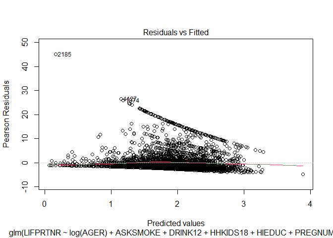
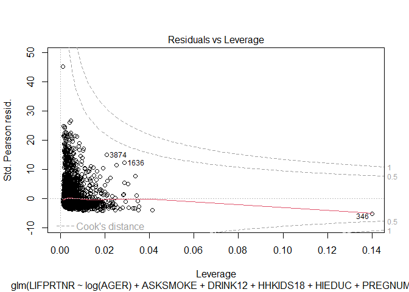
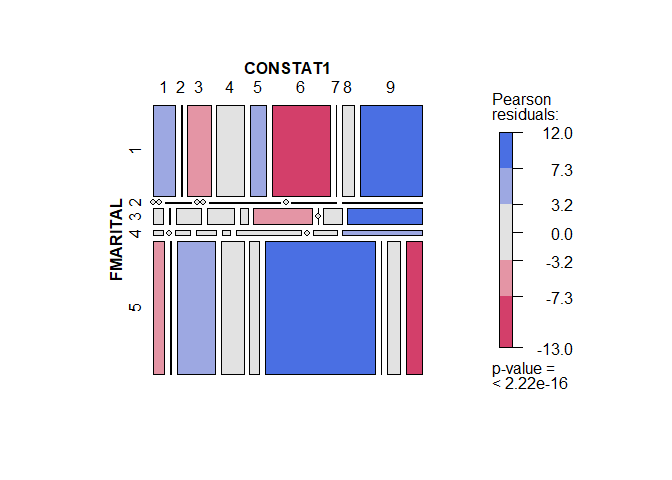
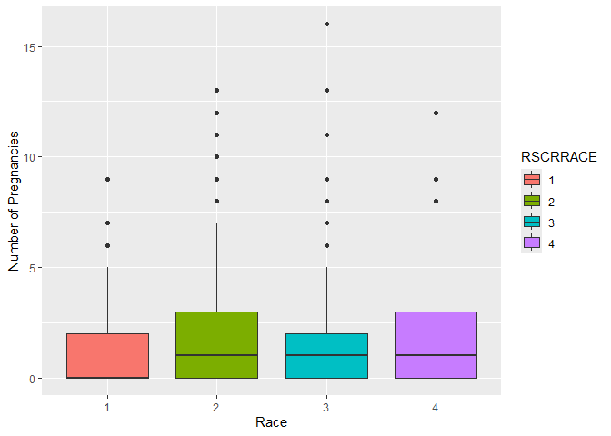
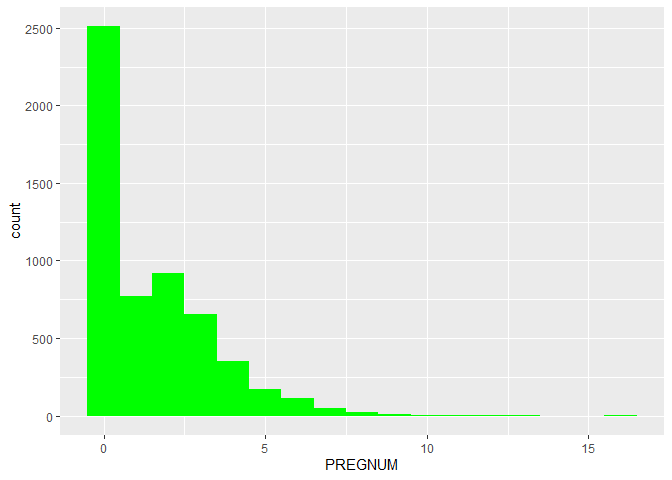
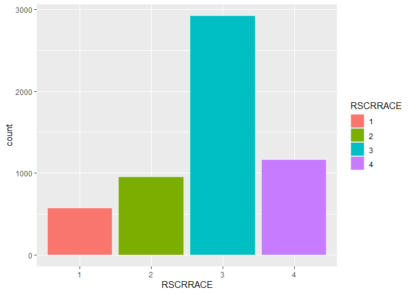

### Analyzing Reproductive Health and Behavior Patterns Using NSFG 2022–2023

Submitted by:

Baybayon, Darlyn Antoinette B.

Mayol, Jose Raphael J.

``` r
suppressPackageStartupMessages({
  library(tidyverse)
  library(dplyr)
  library(readr)
  library(ggplot2)
  library(caret)
  library(glmnet)
  library(cowplot)
  library(psych)
  library(vcd)
  library(AER)
  library(splines)
  library(MASS)
  library(VGAM)
  library(pscl)
})
```

### Dataset

``` r
FemRespData <- read_csv("NSFG_2022_2023_FemRespPUFData.csv", guess_max = Inf,show_col_types = FALSE)
head(FemRespData)
```

    ## # A tibble: 6 × 1,912
    ##   CaseID RSCRAGE RSCRNINF RSCRHISP RSCRRACE FTFMODE DEVICE_TYPE AGE_R AGESCRN
    ##    <dbl>   <dbl>    <dbl>    <dbl>    <dbl>   <dbl> <chr>       <dbl>   <dbl>
    ## 1  96064      29        5        5        3       2 Mobile         29      29
    ## 2  96066      18        5        1        4       2 PC             18      18
    ## 3  96068      37        1        5        2       2 Mobile         37      37
    ## 4  96071      40        1        5        3       2 PC             40      40
    ## 5  96072      49        1        5        2       2 PC             49      49
    ## 6  96074      30        1        5        2       2 Mobile         30      30
    ## # ℹ 1,903 more variables: HISP <dbl>, HISPGRP <dbl>, ROSCNT <dbl>,
    ## #   NUMCHILD <dbl>, HHKIDS18 <dbl>, NONBIOKIDS <dbl>, MARSTAT <dbl>,
    ## #   LMARSTAT <dbl>, RMARIT <dbl>, EVRMARRY <dbl>, SSMARCOH <dbl>, MANREL <dbl>,
    ## #   EARNHS_Y <dbl>, MYSCHOL_Y <dbl>, EARNBA_Y <dbl>, WTHPARNW <dbl>,
    ## #   ONOWN <dbl>, ONOWN18 <dbl>, INTACT <dbl>, PARMARR <dbl>, INTACT18 <dbl>,
    ## #   LVSIT14F <dbl>, LVSIT14M <dbl>, WOMRASDU <dbl>, MOMWORKD <dbl>,
    ## #   MANRASDU <dbl>, FOSTEREV <dbl>, MNYFSTER <dbl>, DURFSTER <dbl>, …

The dataset was retrieved from the 2022-2023 NSFG Public use data files
on Female respondents.

### Variable Selection

``` r
FemRespDataSelect <- FemRespData %>%
  dplyr::select(AGER, RSCRRACE, HHKIDS18, FMARITAL, HIEDUC, GENHEALT, LIFPRTNR, CONSTAT1, PREGNUM, ASKSMOKE, DRINK12)

head(FemRespDataSelect)
```

    ## # A tibble: 6 × 11
    ##    AGER RSCRRACE HHKIDS18 FMARITAL HIEDUC GENHEALT LIFPRTNR CONSTAT1 PREGNUM
    ##   <dbl>    <dbl>    <dbl>    <dbl>  <dbl>    <dbl>    <dbl>    <dbl>   <dbl>
    ## 1    29        3        0        5      4        4        1        6       0
    ## 2    18        4        0        5      5        1        0       40       0
    ## 3    37        2        0        5      6        3        9       33       0
    ## 4    40        3        1        1     10        1        8       31       1
    ## 5    49        2        0        3      9        1        7        1       4
    ## 6    30        2        0        5      9        2        4       42       0
    ## # ℹ 2 more variables: ASKSMOKE <dbl>, DRINK12 <dbl>

The raw dataset had 5,586 observations and 1,912 variables. The
following variables were selected for this analysis:

- AGER - Respondent’s age at interview

- RSCRRACE - Respondent’s race as reported in screener

- HHKIDS18 - No. of children \< 19 years in household

- FMARITAL - Formal (legal) marital status relative to opposite-sex
  spouses

- HIEDUC - Highest completed year of school or highest degree received

- LIFPRTNR - No. of opposite-sex sexual partners in lifetime

- GENHEALT - Respondent’s general health

- CONSTAT1 - Current contraceptive status (1st priority)

- PREGNUM - Total no. of pregnancies

- ASKSMOKE - Asked Respondent whether they smoke cigarettes or other
  tobacco

- DRINK12 - How often drank alcoholic beverages in the last 12 mos.

The variables were chosen from questions applicable to all respondents
to get meaningful insights and generalizations. The variables are to
provide insights on the respondents’ demographics, behavior, and health
data.

### Data Cleaning

Handle missing values and recode variable data types

``` r
summarise_all(FemRespDataSelect, ~sum(is.na(.)))
```

    ## # A tibble: 1 × 11
    ##    AGER RSCRRACE HHKIDS18 FMARITAL HIEDUC GENHEALT LIFPRTNR CONSTAT1 PREGNUM
    ##   <int>    <int>    <int>    <int>  <int>    <int>    <int>    <int>   <int>
    ## 1     0        0        0        0      0        7        0        0       0
    ## # ℹ 2 more variables: ASKSMOKE <int>, DRINK12 <int>

``` r
data_clean <- FemRespDataSelect %>%
  mutate(
    GENHEALT = if_else(is.na(GENHEALT), median(GENHEALT, na.rm= TRUE), GENHEALT),
    GENHEALT = if_else(GENHEALT %in% c(8, 9), median(GENHEALT, na.rm= TRUE), GENHEALT),
    DRINK12 = if_else(is.na(DRINK12), median(DRINK12, na.rm= TRUE), DRINK12),
    DRINK12 = if_else(DRINK12 %in% c(8, 9), median(DRINK12, na.rm= TRUE), DRINK12),
    ASKSMOKE = if_else(ASKSMOKE %in% c(8, 9), median(ASKSMOKE, na.rm= TRUE), ASKSMOKE),
    CONSTAT1 = case_when(
      CONSTAT1 %in% c(1, 2, 35) ~ "Surgical Sterilization",
      CONSTAT1 %in% c(3, 10) ~ "LARC",
      CONSTAT1 %in% c(5, 6, 7, 8) ~ "Hormonal Methods",
      CONSTAT1 %in% c(11, 12, 13) ~ "Barrier Methods",
      CONSTAT1 == 9 ~ "Emergency Contraception",
      CONSTAT1 %in% c(19, 20, 21) ~ "Natural Methods",
      CONSTAT1 == 22 ~ "Others",
      CONSTAT1 %in% c(30, 31, 32, 40, 41, 42) ~ "Non-users",
      CONSTAT1 %in% c(33, 34, 38) ~ "Sterile",
      TRUE ~ "Other"),
    across(c(RSCRRACE, HIEDUC, FMARITAL, GENHEALT, CONSTAT1, ASKSMOKE,DRINK12), as.factor),
    CONSTAT1 = factor(as.numeric(CONSTAT1))
    )%>%
  drop_na()

  
data_clean
```

    ## # A tibble: 5,585 × 11
    ##     AGER RSCRRACE HHKIDS18 FMARITAL HIEDUC GENHEALT LIFPRTNR CONSTAT1 PREGNUM
    ##    <dbl> <fct>       <dbl> <fct>    <fct>  <fct>       <dbl> <fct>      <dbl>
    ##  1    29 3               0 5        4      4               1 3              0
    ##  2    18 4               0 5        5      1               0 6              0
    ##  3    37 2               0 5        6      3               9 8              0
    ##  4    40 3               1 1        10     1               8 6              1
    ##  5    49 2               0 3        9      1               7 9              4
    ##  6    30 2               0 5        9      2               4 6              0
    ##  7    25 2               1 5        5      3              15 1              2
    ##  8    37 3               1 5        6      3              10 4              1
    ##  9    44 3               0 1        5      3               1 6              0
    ## 10    44 3               1 3        8      2               5 9              2
    ## # ℹ 5,575 more rows
    ## # ℹ 2 more variables: ASKSMOKE <fct>, DRINK12 <fct>

``` r
summarise_all(data_clean, ~sum(is.na(.)))
```

    ## # A tibble: 1 × 11
    ##    AGER RSCRRACE HHKIDS18 FMARITAL HIEDUC GENHEALT LIFPRTNR CONSTAT1 PREGNUM
    ##   <int>    <int>    <int>    <int>  <int>    <int>    <int>    <int>   <int>
    ## 1     0        0        0        0      0        0        0        0       0
    ## # ℹ 2 more variables: ASKSMOKE <int>, DRINK12 <int>

Splitting dataset

``` r
set.seed(123)

n <- nrow(data_clean)
train_samples <- sample(1:n, round(0.8*n))

data_train <- data_clean[train_samples, ]
data_test <- data_clean[-train_samples, ]
```

### Statistical Analyses

#### Poisson Regression

``` r
poisson_model <- glm(LIFPRTNR ~ log(AGER) + ASKSMOKE + DRINK12 + HHKIDS18 
                     +HIEDUC + PREGNUM, family=poisson,
                     data = data_train)

summary(poisson_model)
```

    ## 
    ## Call:
    ## glm(formula = LIFPRTNR ~ log(AGER) + ASKSMOKE + DRINK12 + HHKIDS18 + 
    ##     HIEDUC + PREGNUM, family = poisson, data = data_train)
    ## 
    ## Coefficients:
    ##              Estimate Std. Error z value Pr(>|z|)    
    ## (Intercept) -2.737500   0.085449 -32.037  < 2e-16 ***
    ## log(AGER)    1.111386   0.024545  45.280  < 2e-16 ***
    ## ASKSMOKE5   -0.186118   0.015659 -11.886  < 2e-16 ***
    ## DRINK122     0.138291   0.019873   6.959 3.43e-12 ***
    ## DRINK123     0.391225   0.019279  20.292  < 2e-16 ***
    ## DRINK124     0.311492   0.020708  15.042  < 2e-16 ***
    ## DRINK125     0.471504   0.018574  25.386  < 2e-16 ***
    ## DRINK126     0.763237   0.022925  33.293  < 2e-16 ***
    ## HHKIDS18    -0.081200   0.006050 -13.421  < 2e-16 ***
    ## HIEDUC2      0.502526   0.045208  11.116  < 2e-16 ***
    ## HIEDUC3      0.796821   0.039902  19.970  < 2e-16 ***
    ## HIEDUC4      0.378944   0.032801  11.553  < 2e-16 ***
    ## HIEDUC5      0.639266   0.030982  20.634  < 2e-16 ***
    ## HIEDUC6      0.564236   0.035188  16.035  < 2e-16 ***
    ## HIEDUC7      0.597884   0.036620  16.326  < 2e-16 ***
    ## HIEDUC8      0.468323   0.031098  15.060  < 2e-16 ***
    ## HIEDUC9      0.318016   0.033093   9.610  < 2e-16 ***
    ## HIEDUC10     0.335102   0.044957   7.454 9.07e-14 ***
    ## HIEDUC11     0.201424   0.056755   3.549 0.000387 ***
    ## PREGNUM      0.079167   0.003461  22.875  < 2e-16 ***
    ## ---
    ## Signif. codes:  0 '***' 0.001 '**' 0.01 '*' 0.05 '.' 0.1 ' ' 1
    ## 
    ## (Dispersion parameter for poisson family taken to be 1)
    ## 
    ##     Null deviance: 50060  on 4467  degrees of freedom
    ## Residual deviance: 41477  on 4448  degrees of freedom
    ## AIC: 53817
    ## 
    ## Number of Fisher Scoring iterations: 6

A poisson regression model was build to predict the number of
opposite-sex sexual partners in lifetime (LIFPRTNR) using demographic
and behavioral data (age, education, smoking, alcohol, pregnancy, and
no. of kids.). Age, more frequent alcohol consumption, higher
educational attainment, and pregnancy are associated positively with the
number of opposite-sex sexual partners reported in a lifetime. The
number of kids 18 and below in household and not smoking are associated
with lower partner counts

##### Assumption Checks

1.  Count Variable

    - **Assumption**: The dependent variable is a **count**
      (non-negative integers: 0, 1, 2, …).
    - **Remark**: The dependent variable, LIFPRTNR, is a count variable

2.  Independence of observations

    - **Assumption**: The observations are independent of each other.
    - **Remark**: Each row in the dataset represents a unique
      respondent.

3.  Equidispersion

    - **Assumption**: The mean and variance of the outcome are equal

    ``` r
    cat("Mean:", mean(data_clean$LIFPRTNR))
    ```

        ## Mean: 6.800895

    ``` r
    cat("\nVar:", var(data_clean$LIFPRTNR))
    ```

        ## 
        ## Var: 112.1817

    ``` r
    dispersiontest(poisson_model)
    ```

        ## 
        ##  Overdispersion test
        ## 
        ## data:  poisson_model
        ## z = 15.501, p-value < 2.2e-16
        ## alternative hypothesis: true dispersion is greater than 1
        ## sample estimates:
        ## dispersion 
        ##   14.76239

    - **Remark**: The mean and variance are not equal with variance
      being much greater than the mean. Overdispersion is observed

4.  Linearity

    - **Assumption**: Linear relationship between the predictors and the
      log of the expected count

    ``` r
    plot(poisson_model, which =1)
    ```

    <!-- -->

    - **Remark**: By inspection of the Residuals vs. Fitted plot, this
      assumption is violated.

5.  No multicollinearity among predictors

    - **Assumption**: Predictors should not be highly correlated

    ``` r
    vif(poisson_model)
    ```

        ##               GVIF Df GVIF^(1/(2*Df))
        ## log(AGER) 1.298801  1        1.139650
        ## ASKSMOKE  1.050631  1        1.025003
        ## DRINK12   1.169132  5        1.015749
        ## HHKIDS18  1.364404  1        1.168077
        ## HIEDUC    1.334654 10        1.014538
        ## PREGNUM   1.619450  1        1.272576

    - **Remark**: No VIF \> 5, no predictors are highly correlated.

6.  No Outliers

    ``` r
    plot(poisson_model, which=5)
    ```

    <!-- -->

The poisson model failed the assumptions for linearity and
equidispersion and showed high level of overdispersion.

``` r
negbinom_model <- glm.nb(LIFPRTNR ~ log(AGER) + ASKSMOKE + DRINK12 + HHKIDS18 
                     +HIEDUC + PREGNUM, 
                     data = data_train)
summary(negbinom_model)
```

    ## 
    ## Call:
    ## glm.nb(formula = LIFPRTNR ~ log(AGER) + ASKSMOKE + DRINK12 + 
    ##     HHKIDS18 + HIEDUC + PREGNUM, data = data_train, init.theta = 0.7410732654, 
    ##     link = log)
    ## 
    ## Coefficients:
    ##             Estimate Std. Error z value Pr(>|z|)    
    ## (Intercept) -4.37281    0.24681 -17.717  < 2e-16 ***
    ## log(AGER)    1.51192    0.07680  19.685  < 2e-16 ***
    ## ASKSMOKE5   -0.16125    0.04691  -3.438 0.000587 ***
    ## DRINK122     0.23363    0.05896   3.963 7.41e-05 ***
    ## DRINK123     0.48000    0.06012   7.984 1.42e-15 ***
    ## DRINK124     0.42548    0.06443   6.604 4.02e-11 ***
    ## DRINK125     0.59044    0.05974   9.883  < 2e-16 ***
    ## DRINK126     0.82588    0.08786   9.399  < 2e-16 ***
    ## HHKIDS18    -0.06784    0.02173  -3.121 0.001800 ** 
    ## HIEDUC2      0.66781    0.12557   5.318 1.05e-07 ***
    ## HIEDUC3      0.91494    0.13062   7.004 2.48e-12 ***
    ## HIEDUC4      0.46707    0.08328   5.608 2.04e-08 ***
    ## HIEDUC5      0.71569    0.08241   8.685  < 2e-16 ***
    ## HIEDUC6      0.69490    0.10245   6.783 1.18e-11 ***
    ## HIEDUC7      0.68788    0.10871   6.328 2.49e-10 ***
    ## HIEDUC8      0.59207    0.08275   7.155 8.35e-13 ***
    ## HIEDUC9      0.43931    0.09066   4.846 1.26e-06 ***
    ## HIEDUC10     0.43720    0.13778   3.173 0.001507 ** 
    ## HIEDUC11     0.16962    0.17495   0.970 0.332273    
    ## PREGNUM      0.10358    0.01433   7.229 4.86e-13 ***
    ## ---
    ## Signif. codes:  0 '***' 0.001 '**' 0.01 '*' 0.05 '.' 0.1 ' ' 1
    ## 
    ## (Dispersion parameter for Negative Binomial(0.7411) family taken to be 1)
    ## 
    ##     Null deviance: 6050.6  on 4467  degrees of freedom
    ## Residual deviance: 4895.2  on 4448  degrees of freedom
    ## AIC: 25189
    ## 
    ## Number of Fisher Scoring iterations: 1
    ## 
    ## 
    ##               Theta:  0.7411 
    ##           Std. Err.:  0.0180 
    ## 
    ##  2 x log-likelihood:  -25147.0270

#### Contingency Tables

##### Contingency Table

``` r
contable <- structable(CONSTAT1 ~ FMARITAL, data = data_clean)
contable
```

    ##          CONSTAT1    1    2    3    4    5    6    7    8    9
    ## FMARITAL                                                      
    ## 1                  205    5  216  255  150  541    3  112  573
    ## 2                    0    0    3    0    0    8    0    5    9
    ## 3                   16    2   42   44   13   96    0   30  122
    ## 4                    5    0    8   10    4   33    0   12   40
    ## 5                  153   16  513  311  138 1490    1  180  221

``` r
chisq.test(contable, correct = FALSE)
```

    ## Warning in chisq.test(contable, correct = FALSE): Chi-squared approximation may
    ## be incorrect

    ## 
    ##  Pearson's Chi-squared test
    ## 
    ## data:  contable
    ## X-squared = 718.76, df = 32, p-value < 2.2e-16

There is a statistically significant association between contraceptive
method (CONSTAT1) and marital status (FMARITAL) (p\<0.05). The high
X-squared value imply a strong association.

``` r
mosaic(~FMARITAL + CONSTAT1, data = data_clean, gp=shading_max)
```

<!-- -->

#### Categorical Response Modeling

##### Ordinal Logistic Regression

``` r
olr_model <- polr(GENHEALT ~ AGER +DRINK12 + ASKSMOKE + PREGNUM, data = data_train, Hess = TRUE)

summary(olr_model)
```

    ## Call:
    ## polr(formula = GENHEALT ~ AGER + DRINK12 + ASKSMOKE + PREGNUM, 
    ##     data = data_train, Hess = TRUE)
    ## 
    ## Coefficients:
    ##              Value Std. Error t value
    ## AGER       0.01312   0.003268  4.0160
    ## DRINK122   0.36876   0.084399  4.3692
    ## DRINK123   0.37452   0.085522  4.3792
    ## DRINK124   0.25381   0.091602  2.7708
    ## DRINK125  -0.17030   0.084186 -2.0229
    ## DRINK126  -0.07018   0.129687 -0.5412
    ## ASKSMOKE5 -0.22169   0.067733 -3.2730
    ## PREGNUM    0.04177   0.016975  2.4606
    ## 
    ## Intercepts:
    ##     Value   Std. Error t value
    ## 1|2 -0.7522  0.1095    -6.8666
    ## 2|3  0.9135  0.1096     8.3358
    ## 3|4  2.7032  0.1171    23.0767
    ## 4|5  4.5338  0.1529    29.6469
    ## 
    ## Residual Deviance: 11972.60 
    ## AIC: 11996.60

``` r
pR2(olr_model)["McFadden"]
```

    ## fitting null model for pseudo-r2

    ##    McFadden 
    ## 0.009452265

Odds Ratios

``` r
exp(coef(olr_model))
```

    ##      AGER  DRINK122  DRINK123  DRINK124  DRINK125  DRINK126 ASKSMOKE5   PREGNUM 
    ## 1.0132092 1.4459407 1.4542869 1.2889263 0.8434147 0.9322236 0.8011625 1.0426540

##### Multinomial Logistic Regression

``` r
mlr_models <- vglm(FMARITAL ~ PREGNUM +AGER +LIFPRTNR,
                  family = multinomial,
                  data = data_train)

summary(mlr_models)
```

    ## 
    ## Call:
    ## vglm(formula = FMARITAL ~ PREGNUM + AGER + LIFPRTNR, family = multinomial, 
    ##     data = data_train)
    ## 
    ## Coefficients: 
    ##                 Estimate Std. Error z value Pr(>|z|)    
    ## (Intercept):1  -4.414273   0.160426 -27.516  < 2e-16 ***
    ## (Intercept):2 -14.550266   1.945742  -7.478 7.55e-14 ***
    ## (Intercept):3  -8.192545   0.374862 -21.855  < 2e-16 ***
    ## (Intercept):4  -7.501019   0.551370 -13.604  < 2e-16 ***
    ## PREGNUM:1       0.328507   0.024446  13.438  < 2e-16 ***
    ## PREGNUM:2       0.447072   0.108348   4.126 3.69e-05 ***
    ## PREGNUM:3       0.355406   0.036271   9.799  < 2e-16 ***
    ## PREGNUM:4       0.471356   0.050845   9.270  < 2e-16 ***
    ## AGER:1          0.112917   0.004851  23.277  < 2e-16 ***
    ## AGER:2          0.240504   0.044580   5.395 6.86e-08 ***
    ## AGER:3          0.157476   0.009617  16.375  < 2e-16 ***
    ## AGER:4          0.102746   0.014929   6.882 5.89e-12 ***
    ## LIFPRTNR:1     -0.019386   0.003708  -5.228 1.72e-07 ***
    ## LIFPRTNR:2     -0.003954   0.018896  -0.209   0.8343    
    ## LIFPRTNR:3      0.011311   0.004875   2.320   0.0203 *  
    ## LIFPRTNR:4      0.004551   0.008342   0.546   0.5853    
    ## ---
    ## Signif. codes:  0 '***' 0.001 '**' 0.01 '*' 0.05 '.' 0.1 ' ' 1
    ## 
    ## Names of linear predictors: log(mu[,1]/mu[,5]), log(mu[,2]/mu[,5]), 
    ## log(mu[,3]/mu[,5]), log(mu[,4]/mu[,5])
    ## 
    ## Residual deviance: 7116.622 on 17856 degrees of freedom
    ## 
    ## Log-likelihood: -3558.311 on 17856 degrees of freedom
    ## 
    ## Number of Fisher scoring iterations: 8 
    ## 
    ## Warning: Hauck-Donner effect detected in the following estimate(s):
    ## '(Intercept):2', '(Intercept):3', '(Intercept):4'
    ## 
    ## 
    ## Reference group is level  5  of the response

Odds Ratios

``` r
exp(coef(mlr_models))
```

    ## (Intercept):1 (Intercept):2 (Intercept):3 (Intercept):4     PREGNUM:1 
    ##  1.210335e-02  4.796229e-07  2.767089e-04  5.525213e-04  1.388893e+00 
    ##     PREGNUM:2     PREGNUM:3     PREGNUM:4        AGER:1        AGER:2 
    ##  1.563727e+00  1.426760e+00  1.602165e+00  1.119539e+00  1.271890e+00 
    ##        AGER:3        AGER:4    LIFPRTNR:1    LIFPRTNR:2    LIFPRTNR:3 
    ##  1.170553e+00  1.108210e+00  9.808010e-01  9.960540e-01  1.011375e+00 
    ##    LIFPRTNR:4 
    ##  1.004562e+00

Model Fit

``` r
actual <- factor(data_test$FMARITAL)
predicted_probs <- predict(mlr_models, data_test, type = "response")
predicted_classes <- factor(colnames(predicted_probs)[apply(predicted_probs, 1, which.max)], levels = levels(actual))


cf <- confusionMatrix(actual, predicted_classes)
cf
```

    ## Confusion Matrix and Statistics
    ## 
    ##           Reference
    ## Prediction   1   2   3   4   5
    ##          1 260   0   0   0 152
    ##          2   7   0   0   0   0
    ##          3  44   0   0   0  22
    ##          4  18   0   0   0   4
    ##          5 130   0   1   0 479
    ## 
    ## Overall Statistics
    ##                                          
    ##                Accuracy : 0.6616         
    ##                  95% CI : (0.633, 0.6893)
    ##     No Information Rate : 0.5882         
    ##     P-Value [Acc > NIR] : 2.762e-07      
    ##                                          
    ##                   Kappa : 0.3581         
    ##                                          
    ##  Mcnemar's Test P-Value : NA             
    ## 
    ## Statistics by Class:
    ## 
    ##                      Class: 1 Class: 2  Class: 3 Class: 4 Class: 5
    ## Sensitivity            0.5664       NA 0.0000000       NA   0.7291
    ## Specificity            0.7690 0.993733 0.9408602   0.9803   0.7152
    ## Pos Pred Value         0.6311       NA 0.0000000       NA   0.7852
    ## Neg Pred Value         0.7177       NA 0.9990485       NA   0.6489
    ## Prevalence             0.4109 0.000000 0.0008953   0.0000   0.5882
    ## Detection Rate         0.2328 0.000000 0.0000000   0.0000   0.4288
    ## Detection Prevalence   0.3688 0.006267 0.0590868   0.0197   0.5461
    ## Balanced Accuracy      0.6677       NA 0.4704301       NA   0.7221

``` r
accuracy <- cf$overall["Accuracy"]
precision <- cf$byClass[,"Specificity"]
recall <- cf$byClass[,"Sensitivity"]
f1_score <- cf$byClass[,"F1"]

data.frame(
  Metric = c("Accuracy", "Precision", "Recall", "F-1 Score"),
  Value = c(accuracy, mean(precision), mean(recall), mean(f1_score))
)
```

    ##      Metric     Value
    ## 1  Accuracy 0.6615936
    ## 2 Precision 0.8798224
    ## 3    Recall        NA
    ## 4 F-1 Score        NA

``` r
cf
```

    ## Confusion Matrix and Statistics
    ## 
    ##           Reference
    ## Prediction   1   2   3   4   5
    ##          1 260   0   0   0 152
    ##          2   7   0   0   0   0
    ##          3  44   0   0   0  22
    ##          4  18   0   0   0   4
    ##          5 130   0   1   0 479
    ## 
    ## Overall Statistics
    ##                                          
    ##                Accuracy : 0.6616         
    ##                  95% CI : (0.633, 0.6893)
    ##     No Information Rate : 0.5882         
    ##     P-Value [Acc > NIR] : 2.762e-07      
    ##                                          
    ##                   Kappa : 0.3581         
    ##                                          
    ##  Mcnemar's Test P-Value : NA             
    ## 
    ## Statistics by Class:
    ## 
    ##                      Class: 1 Class: 2  Class: 3 Class: 4 Class: 5
    ## Sensitivity            0.5664       NA 0.0000000       NA   0.7291
    ## Specificity            0.7690 0.993733 0.9408602   0.9803   0.7152
    ## Pos Pred Value         0.6311       NA 0.0000000       NA   0.7852
    ## Neg Pred Value         0.7177       NA 0.9990485       NA   0.6489
    ## Prevalence             0.4109 0.000000 0.0008953   0.0000   0.5882
    ## Detection Rate         0.2328 0.000000 0.0000000   0.0000   0.4288
    ## Detection Prevalence   0.3688 0.006267 0.0590868   0.0197   0.5461
    ## Balanced Accuracy      0.6677       NA 0.4704301       NA   0.7221

#### EDA and Multiple Comparisons

Explore the dataset using histograms, bar charts, and boxplots.

``` r
ggplot(data_clean, aes(x = RSCRRACE, y = PREGNUM)) +
  geom_boxplot(aes(fill=RSCRRACE)) +
  labs(x = "Race", y = "Number of Pregnancies")
```

<!-- -->

``` r
ggplot(data_clean, aes(x=PREGNUM)) +geom_histogram(binwidth = 1, fill="green")
```

<!-- -->

``` r
ggplot(data_clean, aes(x=RSCRRACE)) + geom_bar(aes(fill=RSCRRACE))
```

<!-- -->

Conduct multiple tests (e.g., comparing pregnancy outcomes across ethnic
groups) and adjust p-values using Bonferroni or False Discovery Rate
(FDR) methods.

``` r
# pregnancy and race
race_aov <- lm(PREGNUM~RSCRRACE, data=data_clean)
anova(race_aov)
```

    ## Analysis of Variance Table
    ## 
    ## Response: PREGNUM
    ##             Df  Sum Sq Mean Sq F value    Pr(>F)    
    ## RSCRRACE     3   193.5  64.491  19.954 7.339e-13 ***
    ## Residuals 5581 18037.7   3.232                      
    ## ---
    ## Signif. codes:  0 '***' 0.001 '**' 0.01 '*' 0.05 '.' 0.1 ' ' 1

``` r
pairwise.t.test(data_clean$PREGNUM, data_clean$RSCRRACE, p.adjust.method ="bonferroni")
```

    ## 
    ##  Pairwise comparisons using t tests with pooled SD 
    ## 
    ## data:  data_clean$PREGNUM and data_clean$RSCRRACE 
    ## 
    ##   1       2       3     
    ## 2 8.5e-12 -       -     
    ## 3 0.0034  3.1e-08 -     
    ## 4 9.9e-06 0.0166  0.0699
    ## 
    ## P value adjustment method: bonferroni

``` r
pairwise.t.test(data_clean$PREGNUM, data_clean$RSCRRACE, p.adjust.method ="fdr")
```

    ## 
    ##  Pairwise comparisons using t tests with pooled SD 
    ## 
    ## data:  data_clean$PREGNUM and data_clean$RSCRRACE 
    ## 
    ##   1       2       3      
    ## 2 8.5e-12 -       -      
    ## 3 0.00085 1.5e-08 -      
    ## 4 3.3e-06 0.00332 0.01164
    ## 
    ## P value adjustment method: fdr

Discuss risks of Type I error and how adjustments affect conclusions.

Performing multiple tests increases the probability of incorrectly
rejecting true null hypotheses (Type I error) due to multiple
comparisons. To mitigate this, p-values may be adjusted using Bonferroni
or False Discovery Rate (FDR) methods.

Bonferroni method adjusts the p-values by multiplying them by the number
of comparisons. This is a conservative method which reduces Type I
errors but increases Type II errors (false negatives).

FDR adjusts p-values to control the expected proportion of false
positives among the significant results, offering a more balanced
approach that maintains higher statistical power.
