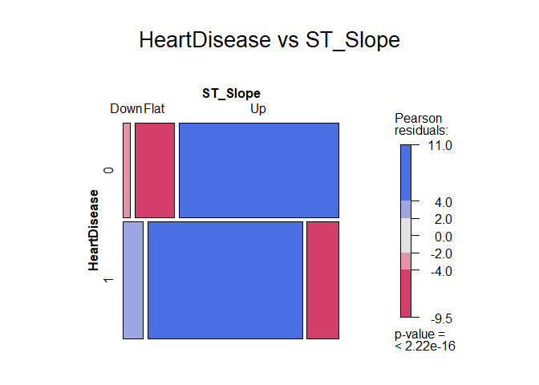
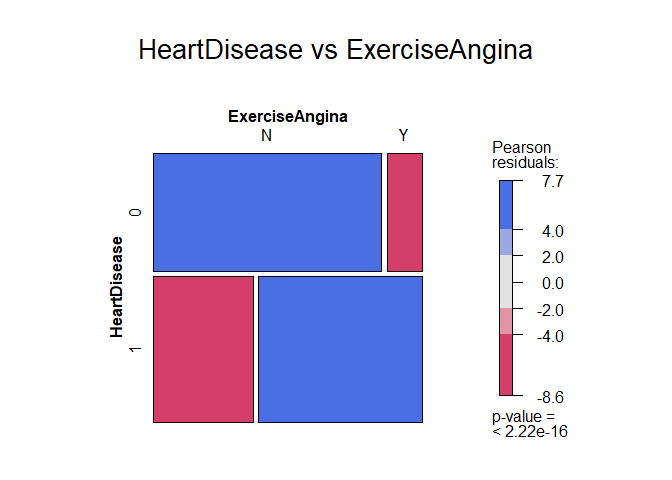
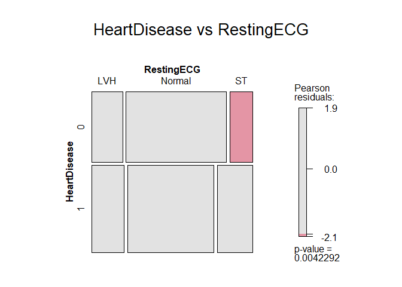
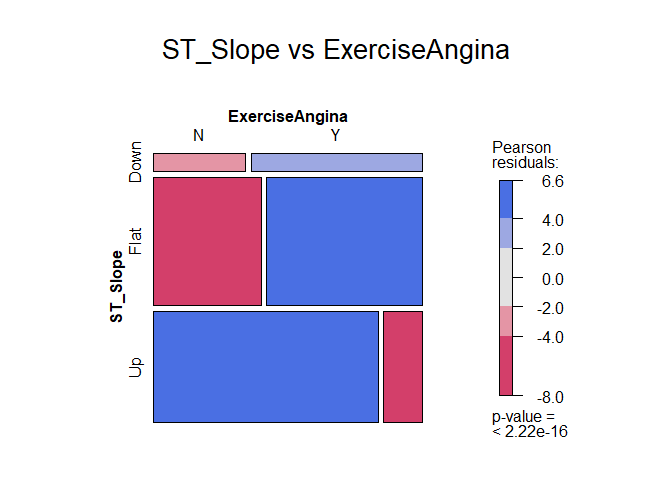
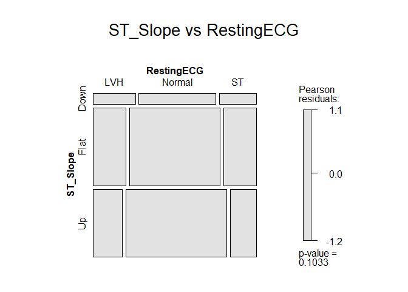
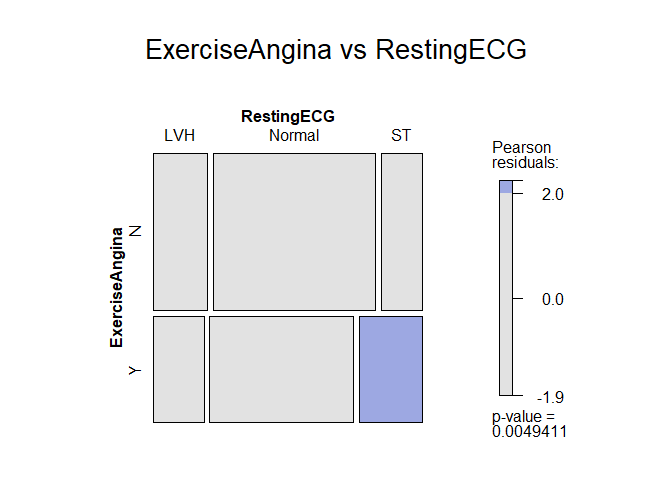
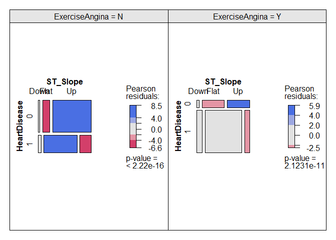

SA2 Bonus
================

``` r
suppressPackageStartupMessages({
  library(tidyverse)
  library(dplyr)
  library(readr)
  library(ggplot2)
  library(caret)
  library(glmnet)
  library(cowplot)
  library(vcd)
})
```

``` r
heart <- read_csv("heart.csv", show_col_types = FALSE)
heart
```

    ## # A tibble: 918 × 12
    ##      Age Sex   ChestPainType RestingBP Cholesterol FastingBS RestingECG MaxHR
    ##    <dbl> <chr> <chr>             <dbl>       <dbl>     <dbl> <chr>      <dbl>
    ##  1    40 M     ATA                 140         289         0 Normal       172
    ##  2    49 F     NAP                 160         180         0 Normal       156
    ##  3    37 M     ATA                 130         283         0 ST            98
    ##  4    48 F     ASY                 138         214         0 Normal       108
    ##  5    54 M     NAP                 150         195         0 Normal       122
    ##  6    39 M     NAP                 120         339         0 Normal       170
    ##  7    45 F     ATA                 130         237         0 Normal       170
    ##  8    54 M     ATA                 110         208         0 Normal       142
    ##  9    37 M     ASY                 140         207         0 Normal       130
    ## 10    48 F     ATA                 120         284         0 Normal       120
    ## # ℹ 908 more rows
    ## # ℹ 4 more variables: ExerciseAngina <chr>, Oldpeak <dbl>, ST_Slope <chr>,
    ## #   HeartDisease <dbl>

``` r
summarise_all(heart, ~sum(is.na(.)))
```

    ## # A tibble: 1 × 12
    ##     Age   Sex ChestPainType RestingBP Cholesterol FastingBS RestingECG MaxHR
    ##   <int> <int>         <int>     <int>       <int>     <int>      <int> <int>
    ## 1     0     0             0         0           0         0          0     0
    ## # ℹ 4 more variables: ExerciseAngina <int>, Oldpeak <int>, ST_Slope <int>,
    ## #   HeartDisease <int>

``` r
heart <- heart %>%
  mutate(
    across(c(HeartDisease, ST_Slope, ExerciseAngina, RestingECG), as.factor)
  )
```

The dataset has information about some predictors of heart disease. The
columns that we will look at are:

HeartDisease: 0/1 for heart disease or not. The variable we would like
to explain.

ST_Slope: Up, down, or flat. A feature related to an electrocardiogram
measurement of the heart.

ExerciseAngina: Y/N for yes/no. A type of chest pain that occurs during
exercise.

RestingECG: LVH/Normal/ST. Describes whether the resting
electrocardiogram measurements were normal (Normal), indicated left
ventricular hypertrophy (LVH), or indicated an STT abnormality (ST).

Make mosaic plots of HeartDisease in combination with each of the other
three variables (so three plots total). Which of the variables seem
useful for predicting HeartDisease? Which do not?

``` r
mosaic(~ HeartDisease + ST_Slope, data = heart,
       shade = TRUE,
       main = "HeartDisease vs ST_Slope")
```

<!-- -->

``` r
mosaic(~ HeartDisease + ExerciseAngina, data = heart,
       shade = TRUE,
       main = "HeartDisease vs ExerciseAngina")
```

<!-- -->

``` r
mosaic(~ HeartDisease + RestingECG, data = heart,
       shade = TRUE,
       main = "HeartDisease vs RestingECG")
```

<!-- --> Compared to
RestingECG (p = 0.004), ST_Slope (p \< 2.22e-16) and ExerciseAngina (p
\< 2.22e-16) are more statistically associated with HeartDisease.
ST_Slope and ExerciseAngina may be more useful for predicting
HeartDisease.

Make mosaic plots to investigate the relationships among the three
potential predictor variables (ST_Slope, ExerciseAngina, and
RestingECG). Are there any pairs that seem like they might be redundant?

``` r
mosaic(~ ST_Slope + ExerciseAngina, data = heart,
       shade = TRUE,
       main = "ST_Slope vs ExerciseAngina")
```

<!-- -->

``` r
mosaic(~ ST_Slope + RestingECG, data = heart,
       shade = TRUE,
       main = "ST_Slope vs RestingECG")
```

<!-- -->

``` r
mosaic(~ ExerciseAngina + RestingECG, data = heart,
       shade = TRUE,
       main = "ExerciseAngina vs RestingECG")
```

<!-- --> ST_Slope and
ExerciseAngina appear to be strongly associated (p \< 2.22e-16) which
may indicate potential redundancy.

Based on the relationship between ST_Slope and ExerciseAngina, we might
wonder if the two together have more information about HeartDisease than
either one individually. Investigate this using a cotabplot.

``` r
tab <- structable(~ HeartDisease + ST_Slope + ExerciseAngina, data = heart)
tab
```

    ##                             ST_Slope Down Flat  Up
    ## HeartDisease ExerciseAngina                       
    ## 0            N                         11   53 291
    ##              Y                          3   26  26
    ## 1            N                         11  135  46
    ##              Y                         38  246  32

``` r
cotabplot(tab, shade = TRUE)
```

<!-- -->

The association of HeartDisease to ST_Slope varies across the levels of
ExerciseAngina.This may indicate that the two predictors together
potentially provide more information on HeartDisease than either
individually.
